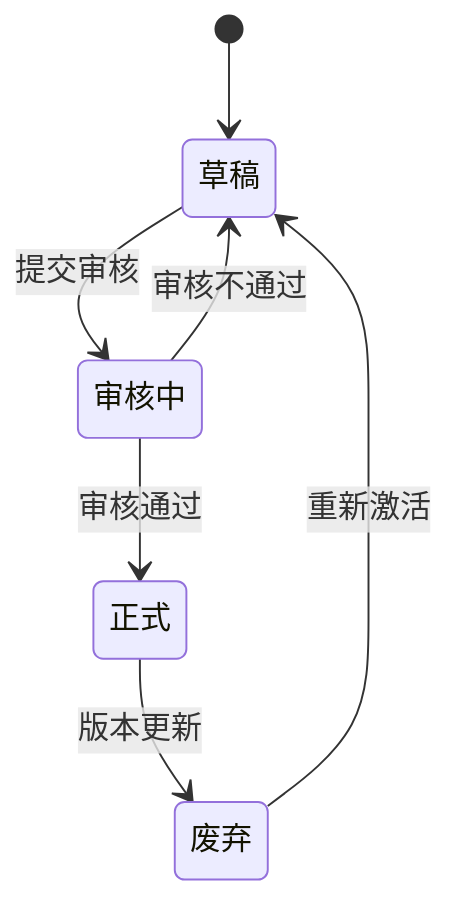
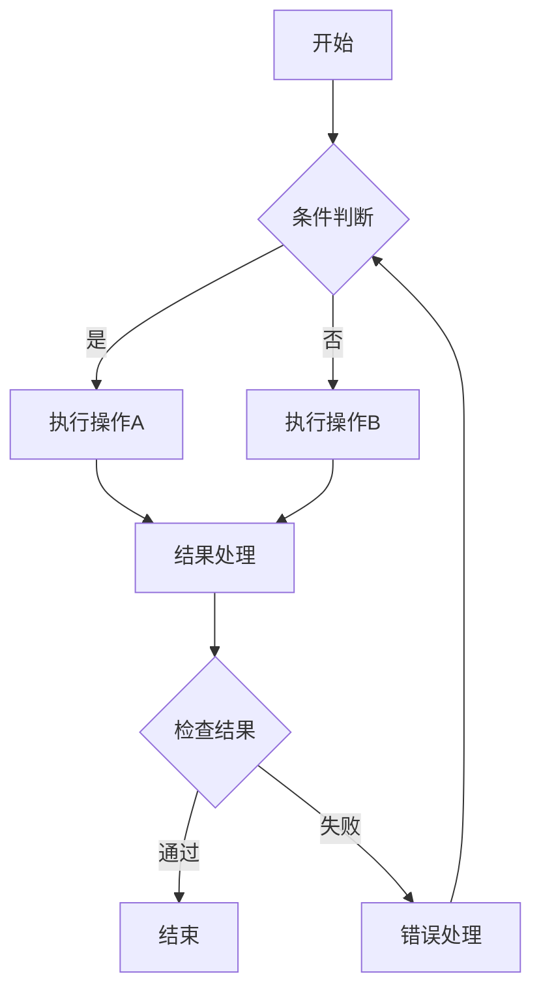
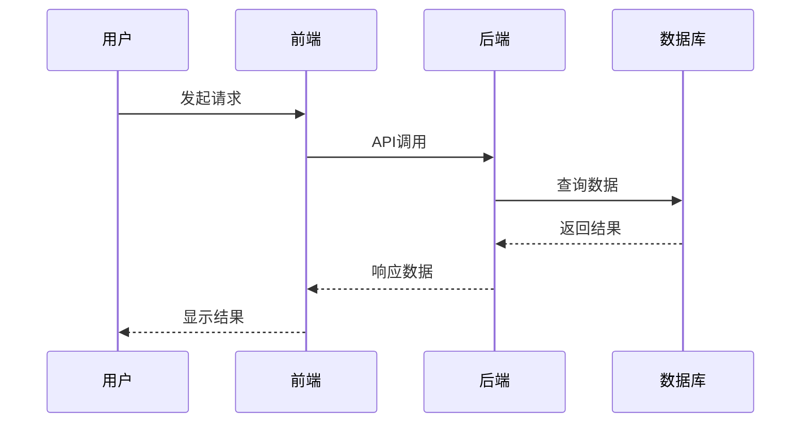
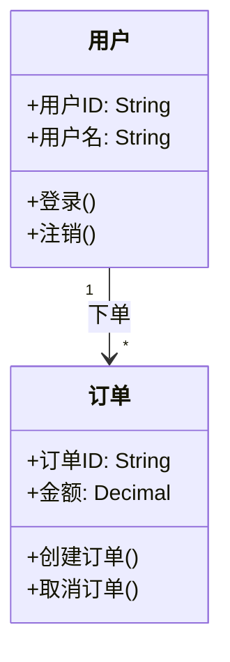
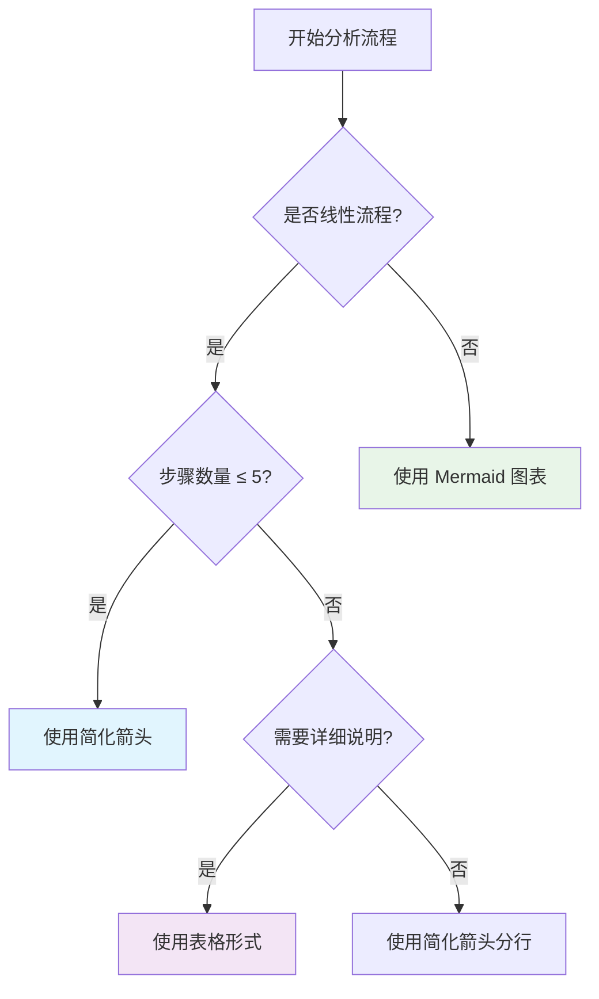

# 流程图格式规范示例

## 格式选择原则

根据流程复杂度选择合适的表示方式：

### 1. 简化箭头形式（单行流程）

**适用场景**：
- 无分支的线性流程
- 无跳转和循环
- 步骤数量较少（建议 ≤ 5 步）

**示例**：
```
用户登录 → 身份验证 → 权限检查 → 进入系统
```

```
需求分析 → 系统设计 → 编码实现 → 测试验证 → 部署上线
```

**格式要求**：
- 使用 `→` 或 `->` 作为箭头
- 步骤间用空格分隔
- 每个步骤简洁明了
- 总长度建议不超过一行

### 2. 表格形式（多步骤流程）

**适用场景**：
- 步骤较多（5-15 步）
- 需要详细说明每个步骤
- 包含输入输出信息

**示例**：

| 步骤 | 操作 | 输入 | 输出 | 负责人 |
|------|------|------|------|--------|
| 1 | 需求收集 | 用户需求 | 需求文档 | 产品经理 |
| 2 | 需求分析 | 需求文档 | 需求规格 | 分析师 |
| 3 | 系统设计 | 需求规格 | 设计文档 | 架构师 |
| 4 | 开发实现 | 设计文档 | 源代码 | 开发工程师 |
| 5 | 测试验证 | 源代码 | 测试报告 | 测试工程师 |

**格式要求**：
- 使用标准 Markdown 表格
- 包含步骤编号
- 明确输入输出
- 可选：负责人、时间等

### 3. Mermaid 图表（复杂流程）

**适用场景**：
- 有分支判断
- 包含循环结构
- 有跳转或回退
- 多个并行路径

#### 3.1 状态流转图



#### 3.2 流程图



#### 3.3 时序图



#### 3.4 类图



## 格式选择决策树



## 常见错误示例

### ❌ 错误的复杂流程使用箭头

```
用户登录 → {验证成功?} → 成功 → 进入系统
              ↓
            失败 → 重新登录
```

**问题**：包含分支判断，不应使用简化箭头

**正确做法**：使用 Mermaid 流程图

### ❌ 错误的简单流程使用 Mermaid


**问题**：简单线性流程，过度复杂化

**正确做法**：使用简化箭头 `步骤1 → 步骤2 → 步骤3`

## 最佳实践

1. **优先选择最简单的格式**：能用箭头就不用表格，能用表格就不用 Mermaid
2. **保持一致性**：同一文档中相同类型的流程使用相同格式
3. **考虑读者**：技术文档可用 Mermaid，业务文档可用表格
4. **工具兼容**：确保目标环境支持所选格式
5. **可维护性**：选择易于更新和维护的格式

## 工具支持

### Mermaid 编辑器
- **在线**：https://mermaid.live/
- **VS Code**：Mermaid Preview 插件
- **Typora**：内置 Mermaid 支持
- **GitLab/GitHub**：原生支持 Mermaid 渲染

### 表格工具
- **Markdown**：标准表格语法
- **Excel/Google Sheets**：可导入导出
- **在线表格生成器**：支持 Markdown 格式

### 箭头符号
- **标准箭头**：`→` (推荐)
- **简单箭头**：`->` (可接受)
- **长箭头**：`==>` (特殊用途)
- **双向箭头**：`<->` (双向关系)
