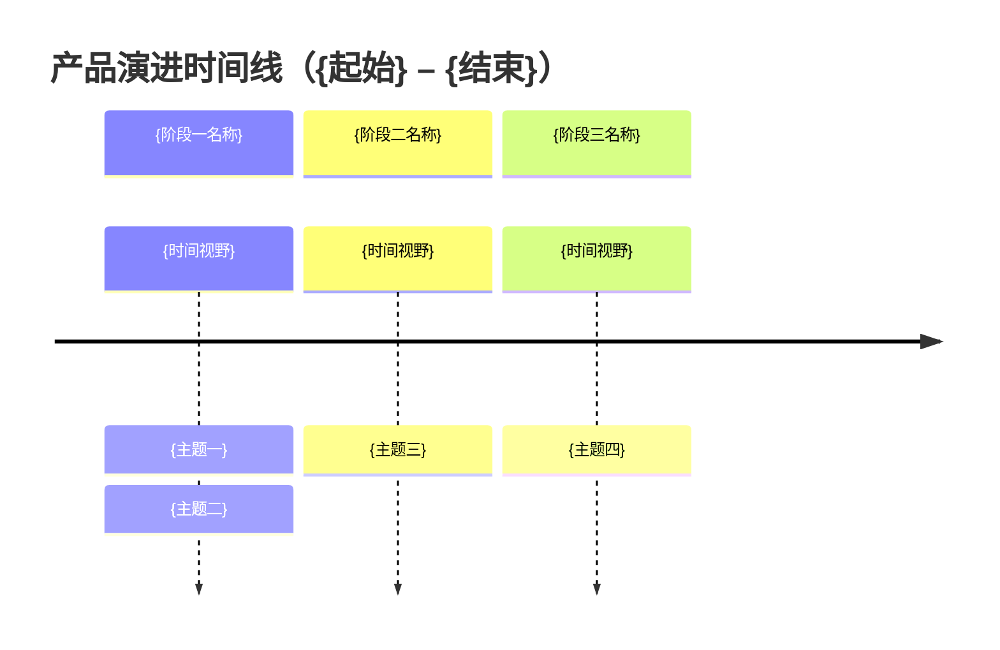
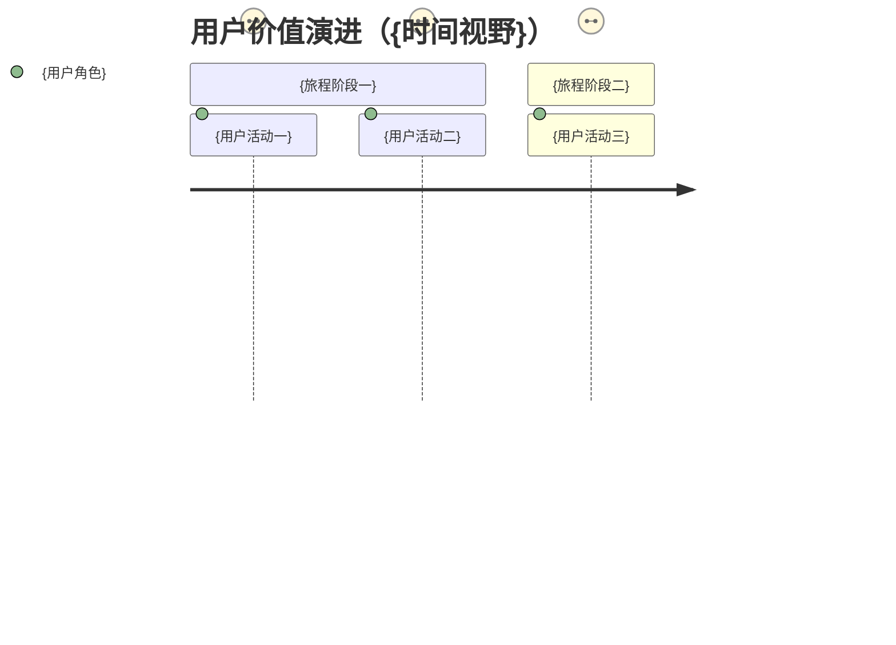

> **模板：L0 - 产品路线图**
>
> **通用规则**：见 [index.md · 整篇型模板共用](index.md#整篇型模板共用)。
>
> **本模板**
>
> 1. `timeline` 必选（阶段—主题），`journey` 可选（用户价值）；占位符替换后须可渲染
> 2. 不填排期 / 工时 / 分工 / 预算，不引用 PLN；阶段与主题不分配细项编码
> 3. 通常不定义细项；未定义时删除《本文档细项编码清单》，仍保留《本文引用》（无跨文档契约链接则留空表）
> 4. 《调整说明》只写规划方向为何变化，不写执行进度
>
> **正文边界**：见 [index.md · 模板边界（哨兵）](index.md#模板边界哨兵)。

---

<!-- TEMPLATE:BEGIN -->
# L0-{编号}-产品路线图

> 本文档描述产品演进的**阶段与主题**，是产品规划的一部分：回答"产品往哪里走、先做什么方向、这些方向服务哪个战略目标"。本文档不跟踪项目执行过程，因此不含里程碑排期、工时、分工与资源预算；时间视野表达规划意图，不是交付承诺。

| 属性     | 值                |
| -------- | ----------------- |
| 文档编码 | L0-{编号}         |
| 层级     | L0 - 战略与愿景   |
| 版本     | v1.0              |
| 状态     | 初稿      |
| 作者     | {当前用户.作者}   |
| 创建日期 | YYYY-MM-DD        |
| 最后更新 | YYYY-MM-DD        |

## 战略对齐

### 关联战略目标
- [GOL-{编号}（{战略目标标题}）]({L0 战略文档相对路径}#gol-{编号})
- [GOL-{编号}（{战略目标标题}）]({L0 战略文档相对路径}#gol-{编号})

### 规划视野

| 视野范围 | 时间粒度 | 衡量参照 |
|----------|----------|----------|
| {起始} – {结束} | {季度 / 半年 / 年度} | [MET-{编号}（{指标标题}）]({L0 战略文档相对路径}#met-{编号}) |

## 演进时间线

## 阶段与主题

### {阶段一名称}（{时间视野}）

本阶段的战略重点：{规划重点描述}。

| 主题 | 目标能力 | 优先级 | 关联细项 |
|------|----------|--------|----------|
| {主题一} | {这一阶段产品要具备的能力} | 高/中/低 | [FR-{编号}（{需求标题}）]({需求文档相对路径}#fr-{编号}) |
| {主题二} | {这一阶段产品要具备的能力} | 高/中/低 | [PRN-{编号}（{原则标题}）]({架构文档相对路径}#prn-{编号}) |

### {阶段二名称}（{时间视野}）

本阶段的战略重点：{规划重点描述}。

| 主题 | 目标能力 | 优先级 | 关联细项 |
|------|----------|--------|----------|
| {主题三} | {这一阶段产品要具备的能力} | 高/中/低 | [{编码}（{细项标题}）]({定义所在文档相对路径}#{编码全小写}) |

## 用户价值演进（可选）

## 调整说明

| 日期 | 调整内容 | 规划理由 | 影响细项 |
| ---- | -------- | -------- | -------- |
| {日期} | {主题/阶段的调整} | {理由} | {受影响的细项编码或「无」} |

## 本文档细项编码清单（仅列出本文档定义/包含）

| 编码 | 类型 | 标题 | 细项状态 |
|------|------|------|----------|
| {类型码}-{编号} | {类型码} | {细项标题} | 初稿 |

## 本文引用

| 引用对象 | 类型 | 所在文档 | 钉住代际 | 钉住日期 |
|----------|------|----------|----------|----------|

## 变更记录

| 版本 | 日期       | 作者   | 变更说明 |
| ---- | ---------- | ------ | -------- |
| v1.0 | YYYY-MM-DD | {当前用户.作者} | 初始版本 |
<!-- TEMPLATE:END -->
