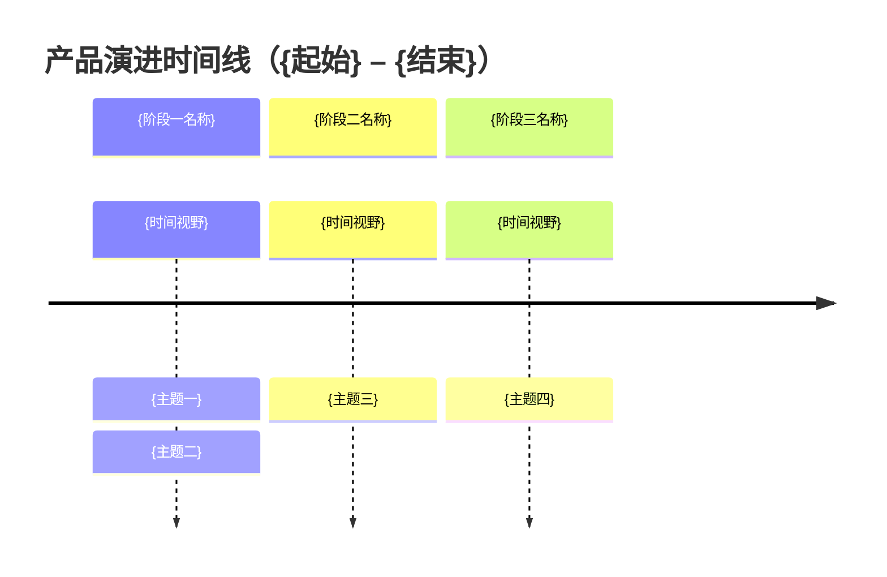
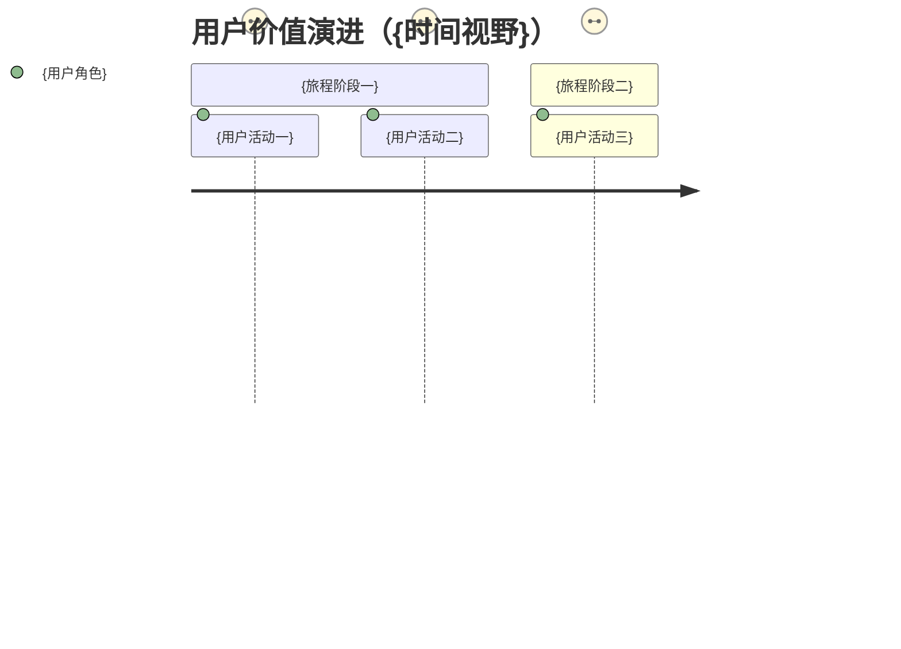

> **模板：L0 - 产品路线图**
>
> **使用说明**
>
> 1. 替换 `{编号}`、`{主题名称}`、`{时间视野}` 等占位符
> 2. 状态值从 `初稿/正式/草案/废弃` 中选择；**新建默认 `初稿`**（缺字段时按 `变更记录` 判定：有定稿条目 → `草案`，从未定稿 → `初稿`，无法判定 → `草案`）
> 3. **编码形式与项目前缀**：见文首说明
> 4. **两张图按需用**：`timeline` 表达阶段—主题演进（必选），`journey` 表达用户视角的价值变化（可选）；两者均为 Mermaid 标准语法，占位符替换后须保证可渲染
> 5. **不写执行信息**：不填里程碑排期、工时、负责团队、资源预算；也不引用 PLN
> 6. **本文档细项编码清单**：路线图通常不定义细项，未定义时删除该节；确有条目时仅登记本文档定义/包含的细项
> 7. 维护变更记录；变更记录按版本号或日期倒序，最新置顶
>
> **正文边界**：`TEMPLATE:BEGIN` / `TEMPLATE:END` 之间为待复制正文；实例化时删除两行哨兵、只保留其间内容（房规见 [index.md · 模板边界（哨兵）](index.md#模板边界哨兵)）。

---

<!-- TEMPLATE:BEGIN -->
# L0-{编号}-产品路线图

> 本文档描述产品演进的**阶段与主题**，是产品规划的一部分：回答"产品往哪里走、先做什么方向、这些方向服务哪个战略目标"。本文档不跟踪项目执行过程，因此不含里程碑排期、工时、分工与资源预算；时间视野表达规划意图，不是交付承诺。

## 文档信息

| 属性     | 值                |
| -------- | ----------------- |
| 文档编码 | L0-{编号}         |
| 层级     | L0 - 战略与愿景   |
| 版本     | v1.0              |
| 状态     | 初稿      |
| 作者     | {当前用户.作者}   |
| 创建日期 | YYYY-MM-DD        |
| 最后更新 | YYYY-MM-DD        |

> **编码形式**：默认使用简洁编码（`{类型码}-{三位序号}`，与正文占位符一致）。
> **项目前缀**：仅在当前作用域 `README.md` 已声明 `project_code` 且请求发起方明确确认启用时，在各类编码前加 `{项目编码}-` 前缀（细则见 `references/coding-system.md`）。

---

## 口径说明

> - **不引用 PLN**：路线图与规划项（PLN）互不关联——路线图不列出 PLN，PLN 也不挂在路线图主题之下（口径见 `references/coding-system.md`）。
> - **阶段与主题不分配细项编码**：它们是本文档的章节内容，不是可被引用的细项；需要长期追溯的方向应落为 FR/NFR/PRN 等正式细项，再由本文档引用其编码。
> - **可引用的对象**：战略目标（GOL）、指标（MET）、需求/设计细项（FR/NFR/PRN/DEC/IF…）。引用一律使用编码链接。

---

## 战略对齐

### 关联战略目标
- [GOL-{编号}（{战略目标标题}）]({L0 战略文档相对路径}#gol-{编号})
- [GOL-{编号}（{战略目标标题}）]({L0 战略文档相对路径}#gol-{编号})

### 规划视野
- **视野范围**：{起始} - {结束}
- **时间粒度**：{季度 / 半年 / 年度}
- **衡量参照**：[MET-{编号}（{指标标题}）]({L0 战略文档相对路径}#met-{编号})

---

## 演进时间线

> 使用 Mermaid **Timeline** 标准语法，按阶段登记主题演进（语法与适用场景见 `assets/guides/flowchart-guide.md`）。

---

## 阶段与主题

### {阶段一名称}（{时间视野}）

**战略重点**：{本阶段的规划重点描述}

**主题**：
1. **{主题一}**
   - **目标能力**：{这一阶段产品要具备的能力}
   - **优先级**：高/中/低
   - **关联细项**：[FR-{编号}（{需求标题}）]({需求文档相对路径}#fr-{编号})

2. **{主题二}**
   - **目标能力**：{这一阶段产品要具备的能力}
   - **优先级**：高/中/低
   - **关联细项**：[PRN-{编号}（{原则标题}）]({架构文档相对路径}#prn-{编号})

### {阶段二名称}（{时间视野}）

**战略重点**：{本阶段的规划重点描述}

**主题**：
1. **{主题三}**
   - **目标能力**：{这一阶段产品要具备的能力}
   - **优先级**：高/中/低
   - **关联细项**：[{编码}（{细项标题}）]({定义所在文档相对路径}#{编码全小写})

---

## 用户价值演进（可选）

> 使用 Mermaid **Journey** 标准语法，从用户视角表达体验随产品演进的改善；分数 1-5 表示当前/目标体验，不作为执行指标。

---

## 调整说明

> 记录路线图的规划变更（主题提前/延后/合并/移除）及其规划理由。只写"为什么调整方向"，不写执行进度。

| 日期 | 调整内容 | 规划理由 | 影响细项 |
| ---- | -------- | -------- | -------- |
| {日期} | {主题/阶段的调整} | {理由} | {受影响的细项编码或「无」} |

---

## 本文档细项编码清单（仅列出本文档定义/包含）

> **清单范围**：仅收录**本文档**定义或包含的细项，**不是** `ued/` 下的全局完整清单。
> **通常为空**：路线图一般不定义细项，只引用既有编码；此时删除本节。若确需在本文档定义 GOL/MET 等细项，则在下方登记。
> **分配流程**：分配编码前必须先检索当前作用域 `README.md` 的全局编码索引，确认无冲突后再分配；分配后同步更新该索引。
> **状态列**：`细项状态` 为必备列，取值 `初稿/正式/草案/废弃`，新建默认 `初稿`（缺字段判定同上）。

| 编码 | 类型 | 标题 | 细项状态 |
|------|------|------|----------|
| {类型码}-{编号} | {类型码} | {细项标题} | 初稿 |

---

## 变更记录

| 版本 | 日期       | 作者   | 变更说明 |
| ---- | ---------- | ------ | -------- |
| v1.0 | YYYY-MM-DD | {当前用户.作者} | 初始版本 |
<!-- TEMPLATE:END -->
