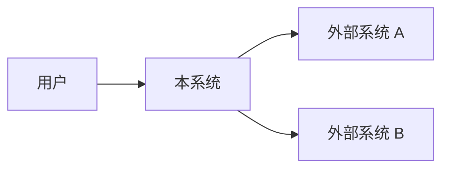
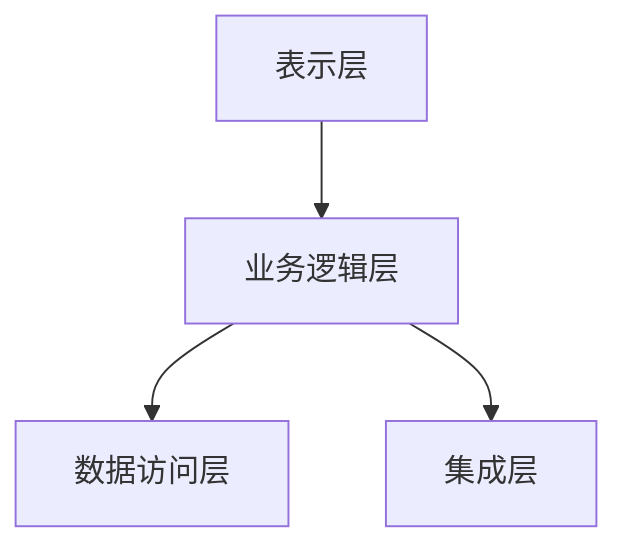

# L3 - 概念架构模板

```markdown
# L3-{编号}-{文档名称}

| 属性       | 值                             |
| ---------- | ------------------------------ |
| 文档编号   | L3-{编号}                      |
| 层级       | L3 - 概念架构                  |
| 版本       | v1.0                           |
| 状态       | 草稿/正式/废弃      |
| 作者       | {当前用户.作者}                         |
| 创建日期   | YYYY-MM-DD                     |
| 最后更新   | YYYY-MM-DD                     |
| 关联文档   | L2-{编号}                      |

## 1. 架构目标与约束

### 1.1 设计目标

- **GOL-{编号}**（引用 L0 目标）：{在架构层面的体现}

### 1.2 架构约束

- **CON-{编号}**：{约束描述，如技术栈限制、团队能力、基础设施}
  - 上层追溯：CON-{编号}（如有来自上层的约束）

### 1.3 架构原则

- **PRN-{编号}**：{原则描述，如松耦合、高内聚}
- **PRN-{编号}**：{原则描述}

## 2. 架构总览

### 2.1 系统上下文

描述系统与外部实体（用户、第三方系统、基础设施）的关系。



### 2.2 高层架构

描述系统的主要子系统/组件及其职责划分。



## 3. 子系统/组件划分

### CMP-{编号}：{组件名称}

- **职责**：{职责描述}
- **关键技术选型**：{技术选型}
- **通信方式**：{同步/异步/...}
- **满足需求**：FR-{编号}, NFR-{编号}

## 4. 关键技术决策

| 决策项     | 选型     | 备选方案 | 决策理由         | ADR 编号 |
| ---------- | -------- | -------- | ---------------- | -------- |
| {决策}     | {选型}   | {备选}   | {理由}           | ADR-{编号} |

（详细决策过程参见 `adr/` 目录下的架构决策记录）

## 5. 数据架构概要

描述数据存储策略、数据流向和数据一致性方案。

## 6. 安全架构概要

描述认证、授权、数据保护等安全策略（追溯 NFR-{编号}）。

## 7. 部署架构概要

描述部署模型、环境规划和基础设施要求。

## 8. 风险与备选方案

- **RSK-{编号}**：{风险描述}
  - 概率：高/中/低
  - 影响：{影响描述}
  - 备选方案：{方案描述}

---

## 细项编码清单

| 编码       | 类型       | 标题     |
| ---------- | ---------- | -------- |
| PRN-{编号} | 原则       | {标题}   |
| CMP-{编号} | 组件       | {标题}   |
| CON-{编号} | 约束       | {标题}   |
| RSK-{编号} | 风险       | {标题}   |

## 变更记录

| 版本 | 日期       | 作者   | 变更说明 |
| ---- | ---------- | ------ | -------- |
| v1.0 | YYYY-MM-DD | {当前用户.作者} | 初始版本 |
```

## 使用说明

1. 替换 `{编号}`、`{文档名称}` 等占位符
2. 状态值从 `草稿/正式/废弃` 中选择
3. 确保所有细项编码全局唯一
4. 关联文档引用对应的 L2 文档编号
5. 维护细项编码清单和变更记录
6. Mermaid 图表可根据实际架构调整
