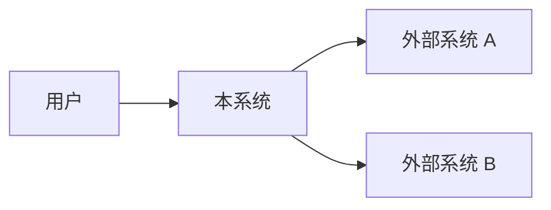
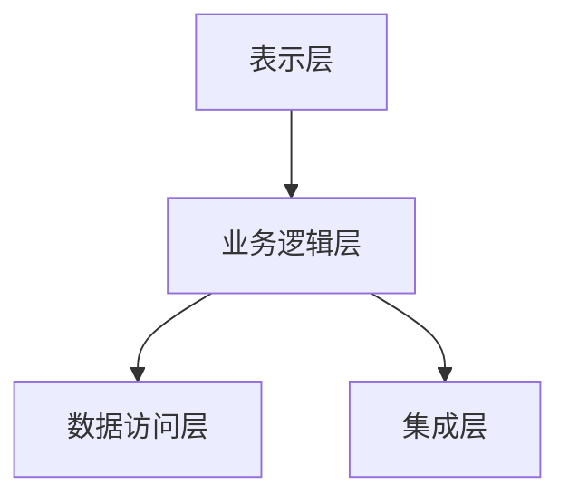

> **模板：L3 - 概念架构**
>
> **通用规则**：见 [index.md · 整篇型模板共用](index.md#整篇型模板共用)。
>
> **本模板**
>
> 1. 技术栈 / 子系统划分等宏观决策另开 ADR（与本文同目录）；《关键技术决策》只登记。切分见 [type-profiles.md · ADR 与 DEC 的定位](../../references/type-profiles.md#adr-与-dec-的定位)
> 2. 组件运行前提写在 CMP 的 `依赖` 行；选型不写进 CMP 正文
> 3. ADR 文件与本层级文档同目录平放，不设独立子目录
> 4. 不要在本稿定义 DOM；领域对象在 L4
> 5. 本稿回答「准备用怎样的系统组织来满足」；产品能力仍用 L2 FR 表达，MUST NOT 在本层定义 FR / NFR，也 MUST NOT 另造特性类型
>
> **正文边界**：见 [index.md · 模板边界（哨兵）](index.md#模板边界哨兵)。

---

<!-- TEMPLATE:BEGIN -->
# L3-{编号}-{文档名称}

| 属性       | 值                             |
| ---------- | ------------------------------ |
| 文档编码   | L3-{编号}                      |
| 层级       | L3 - 概念架构                  |
| 版本       | v1.0                           |
| 状态       | 初稿        |
| 作者       | {当前用户.作者}                         |
| 创建日期   | YYYY-MM-DD                     |
| 最后更新   | YYYY-MM-DD                     |
| 关联文档   | L2-{编号}                      |

## 1. 架构目标与约束

### 1.1 设计目标

- [GOL-{编号}（{L0 目标标题}）]({L0 文档相对路径}#gol-{编号})：{在架构层面的体现}

### 1.2 架构约束

#### CON-{编号}：{约束名称}

- **细项状态**：初稿
- **修订版本号**：1
- **最后修订日期**：YYYY-MM-DD
- **出处**：{外部给定方，如法规 / 平台 / 既有系统}
- **来源**：[CON-{编号}（{上层约束标题}）]({L1 文档相对路径}#con-{编号})

{本约束限定什么：一句话写明约束内容，如技术栈限制、团队能力、基础设施。}

- 影响范围：{受本约束限制的架构对象}
- 不适用范围：{至少写明一条非目标}

### 1.3 架构原则

#### PRN-{编号}：{原则名称}

- **细项状态**：初稿
- **修订版本号**：1
- **最后修订日期**：YYYY-MM-DD
- **来源**：[GOL-{编号}（{L0 目标标题}）]({L0 文档相对路径}#gol-{编号})

{本原则要求什么：一句话写明无备选的贯穿性设计取向，如松耦合、高内聚。}

- 适用范围：{本原则约束的架构对象}
- 判定方式：{如何判定设计是否遵循本原则}

### 1.4 术语与概念（可选）

架构上下文中的组件名、边界用语；与 L2 需求用语冲突时在此对齐。

| 术语 | 定义 | 备注 |
|------|------|------|
| {术语} | {含义} | {与 L2 用语的关系} |

## 2. 架构总览

### 2.1 系统上下文

架构视角下系统与外部实体的信任、集成与部署关系。

```mermaid
graph LR
    User[用户] --> System[本系统]
    System --> ExtA[外部系统 A]
    System --> ExtB[外部系统 B]
```

### 2.2 高层架构

描述系统的主要子系统/组件及其职责划分。

```mermaid
graph TB
    A[表示层] --> B[业务逻辑层]
    B --> C[数据访问层]
    B --> D[集成层]
```

## 3. 子系统/组件划分

### CMP-{编号}：{组件名称}

- **细项状态**：初稿
- **修订版本号**：1
- **最后修订日期**：YYYY-MM-DD
- **满足需求**：[FR-{编号}（{需求标题}）]({L2 文档相对路径}#fr-{编号})

{本组件承担什么：一句话写明组件职责。}

- 职责边界：{输入、输出与协作对象}
- 通信方式：{同步 / 异步 / …}

## 4. 关键技术决策

| 决策项     | 选型     | 备选方案 | 决策理由         | ADR 编号 |
| ---------- | -------- | -------- | ---------------- | -------- |
| {决策}     | {选型}   | {备选}   | {理由}           | ADR-{编号} |

## 5. 数据架构概要

描述数据存储策略、数据流向和数据一致性方案。

## 6. 安全架构概要

描述认证、授权、数据保护等安全策略（追溯 [NFR-{编号}（{非功能需求标题}）]({L2 文档相对路径}#nfr-{编号})）。

## 7. 部署架构概要

描述部署模型、环境规划和基础设施要求。

## 8. 风险与备选方案

### RSK-{编号}：{风险名称}

- **细项状态**：初稿
- **修订版本号**：1
- **最后修订日期**：YYYY-MM-DD
- **概率**：高/中/低

{本风险是什么：一句话写明风险内容。}

- 影响：{影响描述}
- 备选方案：{方案描述}

---

## 本文档细项编码清单（仅列出本文档定义/包含）

| 编码       | 类型       | 标题     | 细项状态 |
| ---------- | ---------- | -------- | -------- |
| PRN-{编号} | 原则       | {标题}   | 初稿    |
| CMP-{编号} | 组件       | {标题}   | 初稿    |
| CON-{编号} | 约束       | {标题}   | 初稿    |
| RSK-{编号} | 风险       | {标题}   | 初稿    |

## 变更记录

| 版本 | 日期       | 作者   | 变更说明 |
| ---- | ---------- | ------ | -------- |
| v1.0 | YYYY-MM-DD | {当前用户.作者} | 初始版本 |
<!-- TEMPLATE:END -->
