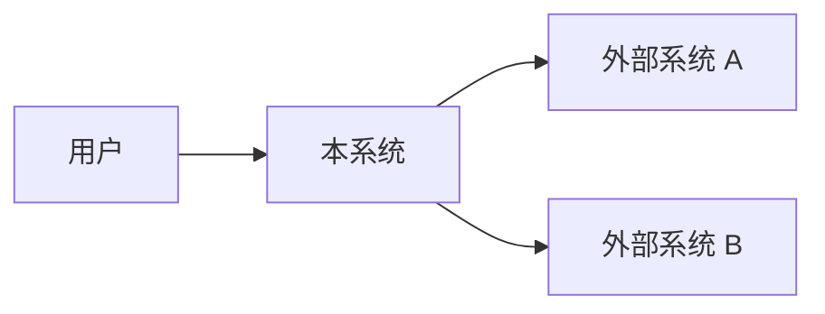
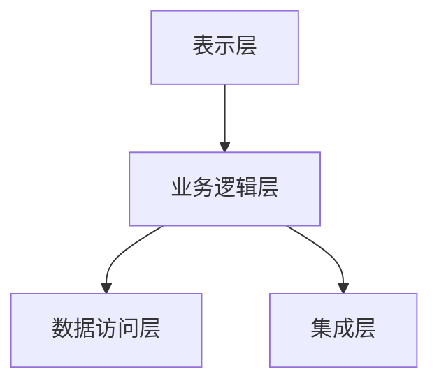

> **模板：L3 - 概念架构**
>
> **使用说明**
>
> 1. 替换 `{编号}`、`{文档名称}` 等占位符
> 2. 状态值从 `初稿/正式/草案/废弃` 中选择；**新建默认 `初稿`**（缺字段时按 `变更记录` 判定：有定稿条目 → `草案`，从未定稿 → `初稿`，无法判定 → `草案`）
> 3. **编码形式与项目前缀**：见文首说明
> 4. **本文档细项编码清单**：仅本文档范围；分配前检索当前作用域 `README.md` 全局索引，分配后同步更新
> 5. **细项定义块形态（MANDATORY）**：每个编码的定义位 MUST 写成「`` 锚点行 + `#### {编码}：{标题}` 标题行（全角冒号，层级比父小节深一级）+ `- **{要素名}**：{值}` 属性行」，MUST NOT 写成 `- **{编码}**：{描述}`；同类多项逐项重复完整块（房规见 [coding-system.md · 细项定义块形态](../../references/coding-system.md#细项定义块形态mandatory)）
> 6. **宏观决策走 ADR**：技术栈选型、子系统划分等架构级决策另开 `ADR-{编号}-*.md`（与本层级文档同目录平放）；《关键技术决策》表只做登记视图。ADR 与 DEC 的分工见 [coding-system.md · ADR 与 DEC 的定位](../../references/coding-system.md#adr-与-dec-的定位)
> 7. 关联文档引用对应的 L2 文档编码
> 8. 维护细项编码清单和变更记录
> 9. Mermaid 图表可根据实际架构调整
>
> **正文边界**：`TEMPLATE:BEGIN` / `TEMPLATE:END` 之间为待复制正文；实例化时删除两行哨兵、只保留其间内容（房规见 [index.md · 模板边界（哨兵）](index.md#模板边界哨兵)）。

---

<!-- TEMPLATE:BEGIN -->
# L3-{编号}-{文档名称}

| 属性       | 值                             |
| ---------- | ------------------------------ |
| 文档编码   | L3-{编号}                      |
| 层级       | L3 - 概念架构                  |
| 版本       | v1.0                           |
| 状态       | 初稿        |
| 作者       | {当前用户.作者}                         |
| 创建日期   | YYYY-MM-DD                     |
| 最后更新   | YYYY-MM-DD                     |
| 关联文档   | L2-{编号}                      |

> **编码形式**：默认使用简洁编码（`{类型码}-{三位序号}`，与正文占位符一致）。
> **项目前缀**：仅在当前作用域 `README.md` 已声明 `project_code` 且请求发起方明确确认启用时，在各类编码前加 `{项目编码}-` 前缀（细则见 `references/coding-system.md`）。

## 1. 架构目标与约束

### 1.1 设计目标

- [GOL-{编号}（{L0 目标标题}）]({L0 文档相对路径}#gol-{编号})：{在架构层面的体现}

### 1.2 架构约束

#### CON-{编号}：{约束名称}

- **约束内容**：{约束描述，如技术栈限制、团队能力、基础设施}
- **出处**：{外部给定方，如法规 / 平台 / 既有系统}
- **影响范围**：{受本约束限制的架构对象}
- **来源**：[CON-{编号}（{上层约束标题}）]({L1 文档相对路径}#con-{编号})

> **逐项重复本块**：每个 `CON` 独立成一个完整定义块，MUST NOT 用连续列表项罗列多个编码。
> **`出处` 与 `来源` MUST NOT 写反**：`出处` = 约束的外部给定方（法规 / 平台 / 既有系统），写**自然语言**；`来源` = 本约束派生自的上层细项，写**编码链接**。无上层约束时整行移除 `来源`（二分房规见 [coding-system.md · 追溯类属性行命名](../../references/coding-system.md#追溯类属性行命名mandatory)）。

### 1.3 架构原则

#### PRN-{编号}：{原则名称}

- **原则内容**：{无备选的贯穿性设计取向，如松耦合、高内聚}
- **适用范围**：{本原则约束的架构对象}
- **判定方式**：{如何判定设计是否遵循本原则}

> **逐项重复本块**：每个 `PRN` 独立成一个完整定义块，MUST NOT 用连续列表项罗列多个编码。
> **PRN 与 DEC 的区分**：`PRN` 是无备选的一贯取向，`DEC` 是多个可行备选中的自主选定（见 [coding-system.md · DEC vs PRN vs CON](../../references/coding-system.md#dec-vs-prn-vs-con)）。

### 1.4 术语与概念（可选）

架构上下文中的组件名、边界用语、与 L2 需求用语对齐说明；无则写「无」或删本节。

| 术语 | 定义 | 备注 |
|------|------|------|
| {术语} | {含义} | 可选：与 L2 文档对齐 |

## 2. 架构总览

### 2.1 系统上下文

描述系统与外部实体（用户、第三方系统、基础设施）的关系。

```mermaid
graph LR
    User[用户] --> System[本系统]
    System --> ExtA[外部系统 A]
    System --> ExtB[外部系统 B]
```

### 2.2 高层架构

描述系统的主要子系统/组件及其职责划分。

```mermaid
graph TB
    A[表示层] --> B[业务逻辑层]
    B --> C[数据访问层]
    B --> D[集成层]
```

## 3. 子系统/组件划分

### CMP-{编号}：{组件名称}

- **职责**：{职责描述}
- **关键技术选型**：{技术选型}
- **通信方式**：{同步/异步/...}
- **满足需求**：[FR-{编号}（{需求标题}）]({L2 文档相对路径}#fr-{编号})、[NFR-{编号}（{需求标题}）]({L2 文档相对路径}#nfr-{编号})

> **逐项重复本块**：每个 `CMP` 独立成一个完整定义块，MUST NOT 用连续列表项罗列多个编码。

## 4. 关键技术决策

| 决策项     | 选型     | 备选方案 | 决策理由         | ADR 编号 |
| ---------- | -------- | -------- | ---------------- | -------- |
| {决策}     | {选型}   | {备选}   | {理由}           | ADR-{编号} |

（详细决策过程参见本层级目录下的 `ADR-{编号}-*.md`；ADR 文件与本层级文档同目录平放，不设独立子目录）

## 5. 数据架构概要

描述数据存储策略、数据流向和数据一致性方案。

## 6. 安全架构概要

描述认证、授权、数据保护等安全策略（追溯 [NFR-{编号}（{非功能需求标题}）]({L2 文档相对路径}#nfr-{编号})）。

## 7. 部署架构概要

描述部署模型、环境规划和基础设施要求。

## 8. 风险与备选方案

### RSK-{编号}：{风险名称}

- **风险描述**：{风险内容}
- **概率**：高/中/低
- **影响**：{影响描述}
- **备选方案**：{方案描述}

> **逐项重复本块**：每个 `RSK` 独立成一个完整定义块，MUST NOT 用连续列表项罗列多个编码。

---

## 本文档细项编码清单（仅列出本文档定义/包含）

> **清单范围**：仅收录**本文档**定义或包含的细项，**不是** `ued/` 下的全局完整清单。
> **分配流程**：分配编码前必须先检索当前作用域 `README.md` 的全局编码索引，确认无冲突后再分配；分配后同步更新该索引。
> **状态列**：`细项状态` 为必备列，取值 `初稿/正式/草案/废弃`，新建默认 `初稿`（缺字段判定同上）；锁定与解冻规则见 `references/status-definitions.md`。

| 编码       | 类型       | 标题     | 细项状态 |
| ---------- | ---------- | -------- | -------- |
| PRN-{编号} | 原则       | {标题}   | 初稿    |
| CMP-{编号} | 组件       | {标题}   | 初稿    |
| CON-{编号} | 约束       | {标题}   | 初稿    |
| RSK-{编号} | 风险       | {标题}   | 初稿    |

## 变更记录

| 版本 | 日期       | 作者   | 变更说明 |
| ---- | ---------- | ------ | -------- |
| v1.0 | YYYY-MM-DD | {当前用户.作者} | 初始版本 |
<!-- TEMPLATE:END -->
