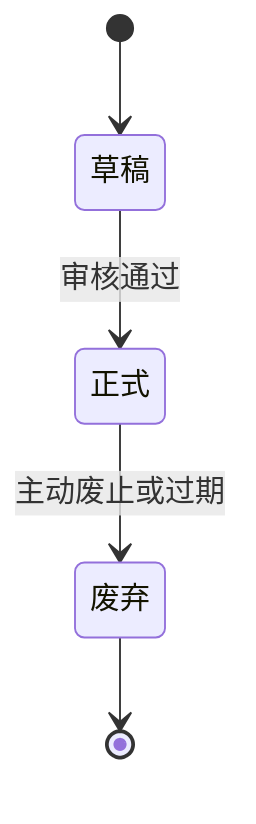
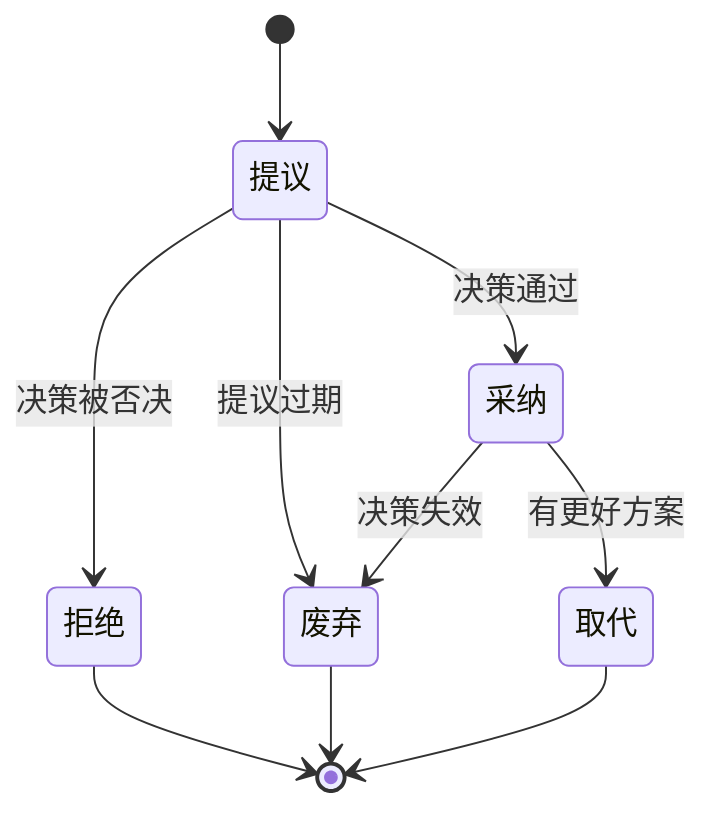
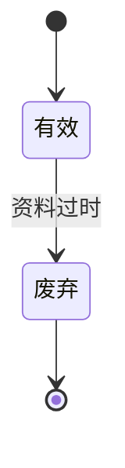
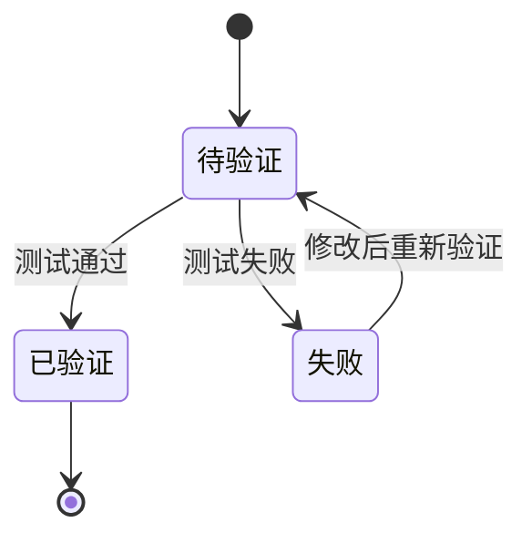

# 状态值标准定义

## 状态值原则

- **一致性**：同类型文档使用相同的状态值集合
- **明确性**：每个状态值有清晰的定义和使用场景
- **渐进性**：状态流转遵循文档生命周期规律

## 标准状态值集合

### 1. 设计文档状态（L0-L6）

| 状态值 | 英文对照 | 含义 | 文档特征 | 备注 |
|--------|----------|------|----------|------|
| **草稿** | Draft | 工作版本，非正式 | 内容编写中，可修改 | 非正式版本，不可作为依据 |
| **正式** | Approved | 已批准，可引用 | 内容稳定，作为依据 | 正式文档，可作为上层引用 |
| **废弃** | Deprecated | 不再使用 | 保留备查，不可引用 | 保留历史记录 |

### 2. 架构决策记录状态（ADR）

| 状态值 | 英文对照 | 含义 | 使用场景 | 备注 |
|--------|----------|------|----------|------|
| **提议** | Proposed | 决策提出，等待讨论 | 新决策提案 | 可修改，征求意见 |
| **采纳** | Adopted | 决策确定，开始执行 | 决策正式通过 | 正式决策，指导设计 |
| **拒绝** | Rejected | 决策未被采纳 | 提议被明确否决 | 保留记录，说明拒绝原因 |
| **废弃** | Deprecated | 决策不再适用 | 被新决策替代 | 保留记录，说明原因 |
| **取代** | Superseded | 被其他决策替代 | 有更好的替代方案 | 标注替代决策编号 |

### 3. 外部参考资料状态（REF）

| 状态值 | 英文对照 | 含义 | 文档特征 |
|--------|----------|------|----------|
| **有效** | Valid | 可引用 | 当前有效的参考资料 |
| **废弃** | Deprecated | 不可引用 | 过时或不可靠，保留备查 |

### 4. 需求追溯状态

| 状态值 | 英文对照 | 含义 | 验证特征 |
|--------|----------|------|----------|
| **待验证** | Pending | 等待测试 | 新需求或修改后需求 |
| **已验证** | Verified | 测试通过 | 满足要求，可用于发布 |
| **失败** | Failed | 测试失败 | 需要修改或重新设计 |

## 状态流转规则

> **格式说明**：使用 Mermaid stateDiagram-v2 语法，确保 AI 解析准确性和可执行性。
> - 支持状态机语义，明确状态转换条件
> - 可视化渲染后人机可读
> - 避免箭头文本图的歧义问题
> 
> **简化流程规则**：
> - **单行流程**（无分支、无跳转、无循环）：可使用简化箭头形式 `A → B → C`
> - **复杂流程**（有分支、跳转或循环）：必须使用 Mermaid 图表
> - **多步骤流程**：也可使用表格形式，步骤清晰列示

### 设计文档（L0-L6）

### 架构决策记录（ADR）

### 外部参考资料（REF）

### 需求追溯

## 使用规范

1. **状态值必须从标准集合中选择**，不得自定义
2. **状态变更需要记录在变更日志中**
3. **废弃状态不可逆**，只能创建新的版本
4. **版本管理机制**（默认，可与组织流程叠加）：
   - 每次状态变更应递增版本号（v1.0, v1.1, v2.0）
   - 草稿→正式：递增次版本号（v1.0 → v1.1）
   - 正式→废弃：保持版本号，标注废弃
   - 重大内容变更：递增主版本号（v1.1 → v2.0）

### 版本与状态联动（可选）

若希望**「正式」已批准文档**在发生实质修订时更醒目地区分基线，可采用以下策略（与上表不冲突，由组织择一或组合）：

- **按变更影响**：错别字、格式、与需求无关的措辞澄清 → 可在保持「正式」前提下递增**次版本**；若变更影响需求承诺、架构边界或对外接口 → 建议视为**重大变更**，递增**主版本**，并重新走评审（可先降为「草稿」再升「正式」，或采用「修订中」等中间状态——须自行定义且与本节状态集合一致）。
- **正式改稿是否先回草稿**：**可以**作为强流程：任一实质修改先将状态从「正式」改回「草稿」，修订完成后再批准；**代价**是流程更重，适合强合规场景。**不建议**把「主版本递增」与「必须回草稿」机械绑定为唯一规则，否则轻量修订也会触发不必要的状态抖动。
- **与 vX.Y 的对应习惯**：可将 **X** 对应「已批准基线」代际，**Y** 对应同一代际下的修订；是否「正式文档一改就升 X」取决于团队对「重大变更」的判定，而非仅看状态字段。

**结论**：状态（草稿/正式）表达**生命周期位置**；版本号表达**内容修订程度**。二者可配合，但不宜用单一规则替代变更评审与影响分析。
5. **状态变更权限**：
   - 草稿→正式：审核者批准
   - 正式→废弃：项目负责人
   - ADR 提议→采纳/拒绝：架构师或技术委员会
   - ADR 采纳→取代/废弃：架构师或技术委员会
   - REF 有效→废弃：项目负责人
   - 需求追溯状态变更：测试负责人

## 模板更新说明

所有模板中的状态字段应使用上述标准状态值，格式为：
- L0-L6：`草稿/正式/废弃`
- ADR：`提议/采纳/拒绝/废弃/取代`
- REF：`有效/废弃`
- 需求追溯：`待验证/已验证/失败`

## 国际化支持

为支持国际化协作和工具集成，建议在工具实现中使用以下英文对照：
- Draft / Approved / Deprecated
- Proposed / Adopted / Rejected / Deprecated / Superseded
- Valid / Deprecated
- Pending / Verified / Failed
