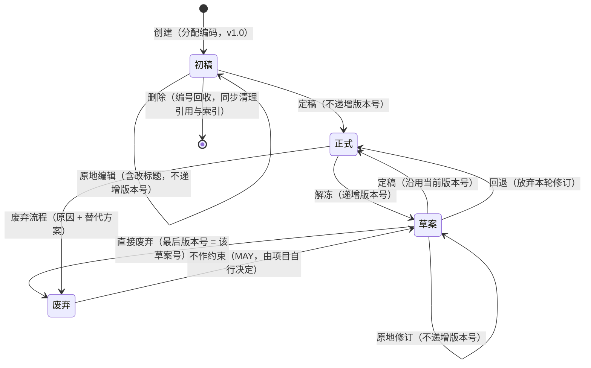

# 状态值标准定义

## 状态值原则

- **单一枚举**：所有对象共用同一套生命周期状态（四态），不为个别类型另设状态集合
- **一致性**：同类型文档使用相同的状态值集合
- **明确性**：每个状态值有清晰的定义、权限边界与版本号后果
- **渐进性**：状态流转遵循对象生命周期规律
- **记录与生命周期分离**：描述事实进展的字段是**记录型字段**（见 [记录型字段](#记录型字段不参与冻结)），不参与冻结，也不得被当作第二套状态枚举使用

## 标准四态（唯一生命周期状态集合）

| 状态值 | 英文对照 | 定义 | 是否冻结 |
|--------|----------|------|----------|
| **初稿** | New | 已分配编码、**从未定过稿**的创作态 | 否 |
| **正式** | Approved | 已定稿的基线，可被引用 | 是 |
| **草案** | Draft | **从 `正式` 解冻而来的迭代态**，与版本号递增严格对应 | 否 |
| **废弃** | Deprecated | 终态，原地保留备查，不可作为引用依据 | 是 |

> `初稿` 与 `草案` 都是未冻结态，区别只在**是否曾定过稿**：`初稿` 从未进入基线（可改标题、可删除），`草案` 曾进入基线后重开（标题锁定、不可删除，只能回退或废弃）。

## 状态即基线（冻结规则，MANDATORY）

对象的 `状态`（文档）/ `细项状态`（编码）是其**唯一冻结判据**，**与版本库（git/svn）无关**。是否递增版本、是否走废弃流程，只看状态，不看是否已提交。

- **状态是基本元素（MUST 存在）**：每份文档必有 `状态`，每个编码细项必有 `细项状态`；**新建即默认 `初稿`**。
- **`细项状态` 的承载位（MUST 一处、MAY 两处）**：清单 / 全局索引表的 `细项状态` 列是**必备**承载位；定义块内的 `- **细项状态**：{值}` 属性行**可选**（PLN、ADR 内的 DEC 等自带完整定义块的细项习惯写在块内）。两处同时出现时取值 **MUST** 一致，不一致由工具报「同一编码状态不一致」。**例外**：细项废弃时 **MUST** 在其定义块内写出 `- **细项状态**：废弃`（废弃四字段与废弃对象同处，见 [item-deprecation.md](item-deprecation.md)）。
- **缺字段的判定（历史版本差异）**：按 `变更记录` 判定——有定稿条目 → 按 `草案` 对待；从未定稿 → 按 `初稿` 对待；无法判定 → **按 `草案` 对待**（保守侧：可编辑正文，但不得改标题、不得删除）。缺字段对象一律纳入定稿确认并补齐字段，不作为阻断性错误。
- **解冻通道（修订）**：要改已 `正式` 对象的内容，先执行 `正式→草案` 解冻（属受控状态变更，须请求确认，**此时递增版本号**），改完再 `草案→正式` 定稿。
- **废止 ≠ 修订**：`正式` 对象若要**彻底退场**，走 `正式→废弃`（不必先解冻）；若要**改**，走 `正式→草案`。`草案` 对象既可直接 `草案→废弃`（**最后版本号即该草案号**，不必先回退），也可 `回退` 到上一 `正式` 基线。
- **编码冻结时机**：编码的**存在性**在其首次转为 `正式` 时锁定（此前可删可回收、不计缺口）；其 **ID 与类型码**从分配那一刻起即不可手改。锁定细则见 [锁定矩阵](#锁定矩阵mandatory) 与 [coding-system.md · 编码含义锁定](coding-system.md#编码含义锁定mandatory)。
- **定稿提示（审查 / 校验时 MANDATORY）**：审查或校验文档时，凡遇到未冻结对象（`初稿`、`草案`，含**缺 `状态` 字段而按上述规则对待**的对象），**MUST** 主动提示用户"该对象尚待定稿"，请其确认。此为提醒而非强制——是否升 `正式` 由人决定；AI **MUST NOT** 自行把 `初稿` / `草案` 改成 `正式`。
  - AI 完成一轮修改后的**交互式提交前定稿确认流程**（列出本轮未冻结对象、批量升格、执行提交）见 [SKILL.md · 修改完毕：定稿确认与提交提示](../SKILL.md#修改完毕定稿确认与提交提示)。

## 锁定矩阵（MANDATORY）

> **分工**：本表是**状态维度**的权限矩阵（要素 × 状态）；「编码锁定」的**语义维度三层**（ID / 标题 / 业务含义）以 [coding-system.md · 编码含义锁定](coding-system.md#编码含义锁定mandatory) 为唯一完整表述。

| 要素 | `初稿` | `正式` | `草案` | `废弃` |
|------|--------|--------|--------|--------|
| **编码 ID / 类型码** | **MUST NOT** 手改（由分配流程产生；类型码用错 → 删除后重新分配，编号可回收） | **MUST NOT** | **MUST NOT** | **MUST NOT**（编号永不复用） |
| **标题** | **可改**，但 **MUST** 先扫描全部引用处并同步修改 | **MUST NOT** | **MUST NOT**（改标题的唯一通道：`废弃` + 新增编码） | **MUST NOT** |
| **正文 / 属性 / 追溯关系** | 可原地编辑 | 锁定（须先解冻为 `草案`） | 可原地编辑 | 只读 |
| **存在性** | 可删除，但 **MUST** 同步清理全部引用与索引条目（编号回收） | **MUST NOT** 删除，只能 `废弃` | **MUST NOT** 删除；只能 `回退`（→ `正式`）或 `废弃` | 文档：原地标废弃 + **建议归档日期**，到期移入 `deprecated/`；细项：**原地保留，不移除、不删除** |
| **记录型字段** | 可追加 / 修改 | **可追加 / 修改**（不解冻、不变号） | 可追加 / 修改 | 可追加 |

- **引用同步义务**：`初稿` 期改标题或删除对象前，**MUST** 定位全部引用处（可用 `python3 scripts/check_docs.py --refs {编码}`）并一并修改，不得留下悬空引用。
- 锁定与状态**正交**：`状态` 只决定"标题之外的内容能否直接改"以及"能否删除"，**不得用状态削弱编码 ID 与类型码的绝对锁定**。

## 记录型字段（不参与冻结）

以下字段描述事实进展或登记信息，**追加或修改都不触发解冻、不递增版本号**，即使在 `正式` / `废弃` 态也可直接维护：

| 字段 | 所属对象 | 含义 |
|------|----------|------|
| `变更记录` | 全部对象 | 版本与修订历史，**MUST** 完整保留（含被回退弃用的版本号条目） |
| `废弃时间` / `废弃原因` / `替代方案` | 已废弃对象 | 废弃登记；`替代方案` 同时承载 ADR「取代」语义 |
| `落实记录` | PLN 细项 | 想法已展开为具体细项时写入目标编码（与定稿同步） |
| `建议复审日期` | PLN 细项 | 未定论想法（`初稿` / `草案`）的时间兜底；到期只提示复核，不自动改状态 |
| `来源版本` / `获取日期` / `最近核验日期` / `复查周期` / `失效风险` | REF | 参考资料时效登记，用于评估是否过期 |
| `追溯状态` | L6 追溯矩阵 | 需求与验证要素的追溯覆盖情况 |
| `状态`（注册表列） | 应用注册表行 | 应用登记条目的生命周期位置 |

## 状态流转规则

> **格式说明**：使用 Mermaid stateDiagram-v2 语法，确保 AI 解析准确性和可执行性。
> - 支持状态机语义，明确状态转换条件
> - 可视化渲染后人机可读
> - 避免箭头文本图的歧义问题
>
> **简化流程规则**：
> - **单行流程**（无分支、无跳转、无循环）：可使用简化箭头形式 `A → B → C`
> - **复杂流程**（有分支、跳转或循环）：必须使用 Mermaid 图表
> - **多步骤流程**：也可使用表格形式，步骤清晰列示

### 统一状态机（适用所有对象）

```mermaid
stateDiagram-v2
    [*] --> 初稿 : 创建（分配编码，v1.0）
    初稿 --> 初稿 : 原地编辑（含改标题，不递增版本号）
    初稿 --> 正式 : 定稿（不递增版本号）
    初稿 --> [*] : 删除（编号回收，同步清理引用与索引）
    正式 --> 草案 : 解冻（递增版本号）
    草案 --> 草案 : 原地修订（不递增版本号）
    草案 --> 正式 : 定稿（沿用当前版本号）
    草案 --> 正式 : 回退（放弃本轮修订）
    草案 --> 废弃 : 直接废弃（最后版本号 = 该草案号）
    正式 --> 废弃 : 废弃流程（原因 + 替代方案）
    废弃 --> 草案 : 不作约束（MAY，由项目自行决定）
```

> **回退**：`草案` 期修订被放弃时，版本号回到解冻前的号、内容回到上一 `正式` 基线，但**变更记录 MUST 完整保留**被弃用的那个版本号条目（标注"本轮修订放弃"）；该号**永不复用**，下次解冻从历史最大号继续递增。
>
> **废弃后再入 `草案`**：本规范**不作约束**，由项目自行决定；校验工具不检查该转换、不报违规。

### 各对象的定稿与废弃语义

四态适用于所有对象，下表只说明各对象在关键转换上的**业务含义**（不改变状态机）：

| 对象 | `初稿→正式` 的含义 | `正式→废弃` 的含义 |
|------|-------------------|-------------------|
| L0-L6 文档 / 细项 | 评审通过，成为可引用基线 | 内容不再适用 |
| ADR | 决策被采纳 | 决策失效（`废弃原因`）或被新决策替代（`替代方案` 填新 ADR 编码，即原「取代」语义）；评审未通过亦记 `废弃` + 原因（即原「拒绝」语义） |
| REF | 来源与适用边界核验通过 | 资料过时或不可靠 |
| PLN 细项 | **已展开为具体细项**（定稿与落实同步：`落实记录` 指向目标编码，目标细项以 `来源` 回指） | 不再纳入产品演进（`废弃原因` 记决策依据）；已落实者**不废弃**，保持 `正式` |

### 需求追溯状态（记录型）

L6 是**设计文档**层级，记录验证策略与追溯覆盖关系，**不记录测试执行结果**（通过 / 失败 / 缺陷数属测试管理系统的职责）。

| 状态值 | 英文对照 | 含义 |
|--------|----------|------|
| **未追溯** | Untraced | 需求尚未建立与验收标准 / 测试场景 / 设计要素的链接 |
| **已追溯** | Traced | 双向追溯链接齐备 |
| **不适用** | Not Applicable | 该项无需独立验证覆盖 |

追溯矩阵列：`需求编码 | 需求标题 | 验收标准 / 测试场景 | 设计要素 | 追溯状态 | 备注`。其中「验收标准 / 测试场景」是**定义**，不是执行记录。

### 应用注册表状态（记录型）

注册表行的 `状态` 列直接取四态，不设专属枚举：`初稿`（已登记、尚未启用）、`正式`（在用）、`废弃`（已停用，保留登记以供追溯）；`草案` 亦合法（登记信息需修订时）。

## 变更流程与版本号（统一，MANDATORY）

状态与版本号**不绑定**，但递增时机唯一：**`正式→草案` 解冻是版本号唯一正规递增时机**。

| 变更动作 | 状态流转 | 版本号 | 说明 |
|----------|----------|--------|------|
| 新建对象 | → `初稿` | 起始 `v1.0` | 新建即 `v1.0` + `初稿`，不必先起 `v0.x` |
| 初稿期修改（含改标题） | `初稿` 原地 | **不递增** | 属同一创作过程，零版本抖动 |
| 定稿 | `初稿→正式` | **不递增** | 状态升格本身即一次变更，无需再变号 |
| 解冻修订 | `正式→草案` | **递增**（唯一正规时机） | 与旧基线区别，解冻时递增一次 |
| 草案期修订 | `草案` 原地 | **不递增** | 同一修订轮次内反复修改 |
| 再次定稿 | `草案→正式` | **不递增** | 沿用解冻时递增后的号 |
| 回退 | `草案→正式` | **回到解冻前的号** | 内容回到上一 `正式` 基线；变更记录保留被弃号；该号不复用 |
| 废止 | `正式→废弃` | **不递增** | 保留原版本号并标注废弃 |
| 废止修订中的对象 | `草案→废弃` | **不递增** | **最后版本号即该草案号**（如 `v1.1`），不必先回退 |

- **递增基准**：解冻时的递增以**该对象历史上出现过的最大版本号**为基准（含被回退弃用的号），保证版本号单调计数、永不复用。
- **主 / 次版本判定**（在解冻递增时选择）：错别字、格式、与承诺无关的澄清 → 次版本（`v1.0→v1.1`）；影响需求承诺、架构边界或对外接口 → 主版本（`v1.0→v2.0`）。
- 状态表达**生命周期位置**，版本号表达**内容修订代际**；二者正交，都不得用来替代变更评审与影响分析。

**示例（含回退）**：`v1.0 正式` → 解冻 → `v1.1 草案` → 放弃修订 → `v1.0 正式`（变更记录保留 `v1.1` 条目并注明放弃）→ 再解冻 → `v1.2 草案`（**不是 `v1.1`**）。

## 废弃与归档

| 对象 | 处理 |
|------|------|
| 细项 | **原地标注 `废弃` 即可**，不归档、不删除，留在设计文档中备查；细则见 [item-deprecation.md](item-deprecation.md) |
| 文档 | 两阶段：先原地标 `废弃` 并给出**建议归档日期**（不移动），到期后移入本作用域 `deprecated/`（只移除不删除）；细则见 [doc-deprecation.md](doc-deprecation.md) |
| `初稿` 对象 | 尚未发布、不构成基线：**不走废弃流程**，直接删除（文档删文件、细项删条目），并同步清理引用与索引，编号回收 |

- 废弃后 `最后更新` 表示废弃发生的时间。
- **废弃是终态**：需重新承担同等职责时，只能新建对象并分配新编码（旧编号永不复用）。

## 状态变更权限

1. `初稿→正式`（定稿）：审核者批准
2. `初稿` 期删除：对象创建者或项目负责人
3. `正式→草案`（解冻）：对象负责人发起，须请求确认，并在该时刻递增版本号
4. `草案→正式`（定稿 / 回退）：审核者批准
5. `正式→废弃`、`草案→废弃`：项目负责人（ADR 由架构师或技术委员会）
6. `废弃→草案`：不作约束，由项目自行决定
7. 记录型字段维护：对象负责人
8. `追溯状态` 变更：验证负责人

## 模板更新说明

所有模板中的状态字段应使用上述标准值，格式为：

- 文档元信息：`状态` = `初稿/正式/草案/废弃`，**新建默认 `初稿`**（模板中只写纯枚举值，默认值说明写在模板正文的注记里，避免被校验判为无效状态值）
- 细项清单：`细项状态` = 同上四态
- L6 追溯矩阵：字段名 `追溯状态`，取值 `未追溯/已追溯/不适用`
- 应用注册表：字段名 `状态`，取值同上四态
- REF 细项：四态 + 记录型时效字段（`来源版本` / `获取日期` / `最近核验日期` / `复查周期` / `失效风险`）

## 存量文档迁移

本版本把各类型的专属状态枚举统一为标准四态，旧写法按下表就地改写。**迁移只改状态值与字段名**，MUST NOT 借此改动标题或编码。

| 存量写法 | 迁移为 | 说明 |
|----------|--------|------|
| `草稿` | 按 `变更记录` 判定 | 有定稿条目 → `草案`；从未定稿 → `初稿`；无法判定 → `草案` |
| ADR `提议` | `初稿` | |
| ADR `采纳` | `正式` | |
| ADR `拒绝` | `废弃` + `废弃原因` | 评审未通过 |
| ADR `取代` | `废弃` + `替代方案` | `替代方案` 填新 ADR 编码 |
| REF `登记中` | `初稿` | |
| REF `有效` | `正式` | 迁移时 MUST 一并补齐五个时效字段 |
| PLN `规划状态` | **删除该字段** | `待考虑` / `已纳入规划` → `初稿` + `建议复审日期`（尚未落实即尚未定论）；`已落实` → `正式` + `落实记录`；`不再考虑` → `废弃` + `废弃原因` |
| PLN `正式` 但 `落实记录` 为「无」 | 改回 `初稿` + 补 `建议复审日期` | 旧口径允许「先定正式、后落实」，新口径下定稿与落实同步，该想法其实尚未定论；确已落实者则补 `落实记录`，并在目标细项补 `来源` 回指 |
| L6 `验证状态` | 列名改 `追溯状态` | `待验证` → `未追溯`；`已验证` → `已追溯`；原「失败」等执行结果移出设计文档 |
| 注册表 `应用状态` | 列名改 `状态` | `使用中` → `正式`；`已停用` → `废弃` |
| `建议移除日期` | `建议归档日期` | 归档只移除不删除 |

- **不计作修订**：规范对齐属格式迁移，MAY 直接在原状态上改写，**不解冻、不递增版本号、不追加 `变更记录` 条目**。
- **不阻断校验**：`check_docs.py` 对上表旧值**不判为无效**，而是映射到四态后以 INFO「状态值待迁移」提示；旧列名 / 字段名则提示「追溯列名待迁移」「废弃字段名待迁移」。两类提示均不影响退出码，迁移完成后自行消失。
- **同作用域一次做完**：MUST 覆盖同一作用域内全部文档，避免新旧混用造成引用歧义。

## 国际化支持

为支持国际化协作和工具集成，建议在工具实现中使用以下英文对照：

- New / Approved / Draft / Deprecated（四态）
- Untraced / Traced / Not Applicable（`追溯状态`）
