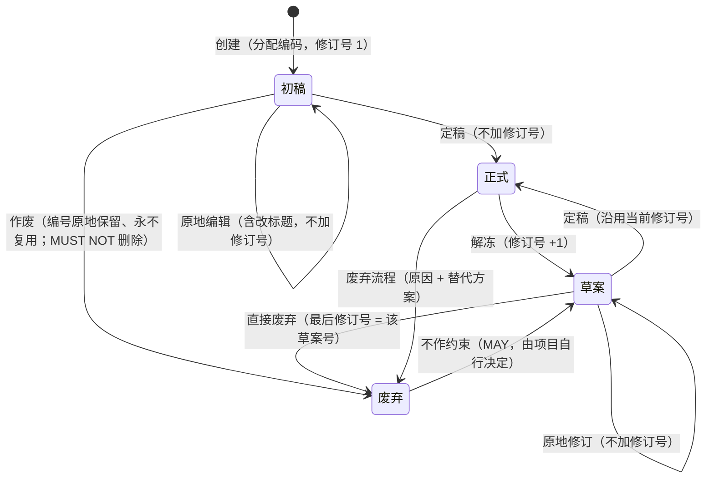

# 状态值标准定义

## 状态值原则

- **单一枚举**：所有对象共用同一套生命周期状态（四态），不为个别类型另设状态集合
- **一致性**：同类型文档使用相同的状态值集合
- **明确性**：每个状态值有清晰的定义、权限边界与修订号后果
- **渐进性**：状态流转遵循对象生命周期规律
- **记录与生命周期分离**：描述事实进展的字段是**记录型字段**（见 [记录型字段](#记录型字段不参与冻结)），不参与冻结。记录型字段 **MAY** 有封闭值域（如 PLN `落实情况` 的 `未落实` / `已落实`、L6 `追溯状态` 的三值），但 **MUST NOT** 与生命周期语义重叠、**MUST NOT** 被当作决定可编辑性与可否删除的第二套状态枚举使用（原 PLN `规划状态` 即因此删除）
- **字段按写入者分类**：对象种类与字段写入者总表单点在 [object-model.md](object-model.md)；本文只保留状态机、记录型/流转伴随的**含义与初值**、门控与修订号判定表。产品版本见 [product-version.md](product-version.md)

## 标准四态（唯一生命周期状态集合）

| 状态值 | 英文对照 | 定义 | 是否冻结 |
|--------|----------|------|----------|
| **初稿** | New | 已分配编码、**从未定过稿**的创作态 | 否 |
| **正式** | Approved | 已定稿的基线，可被引用 | 是 |
| **草案** | Draft | **从 `正式` 解冻而来的迭代态**，与修订号递增严格对应 | 否 |
| **废弃** | Deprecated | 终态，原地保留备查，不可作为引用依据 | 是 |

> `初稿` 与 `草案` 都是未冻结态，区别只在**是否曾定过稿**：`初稿` 从未进入基线（可改标题、可直接作废），`草案` 曾进入基线后重开（标题锁定，只能定稿或废弃）。两者都 **MUST NOT** 删除——放弃的唯一通道是**作废**（→ `废弃`）。

## 状态即基线（冻结规则，MANDATORY）

对象的 `状态`（文档）/ `细项状态`（编码）是其**唯一冻结判据**，**与版本库（git/svn）无关**。是否递增修订号、是否走废弃流程，只看状态，不看是否已提交。产品版本不参与冻结，见 [product-version.md](product-version.md)。

- **状态是基本元素（MUST 存在）**：每份文档必有 `状态`，每个编码细项必有 `细项状态`；**新建即默认 `初稿`**。
- **`细项状态` 的承载位（MUST 两处）**：清单 / 全局索引表的 `细项状态` 列与定义块内的 `- **细项状态**：{值}` 属性行**都是必备**承载位，缺任一处即违规；块内属性行 **MUST** 是属性行组的**首行**（治理段第一位，见 [coding-system.md · 细项定义块形态](coding-system.md#细项定义块形态mandatory)）。两处取值 **MUST** 一致，不一致由工具报「同一编码状态不一致」。细项废弃时块内的 `- **细项状态**：废弃` 已由本条覆盖，废弃四字段紧随治理段、与废弃对象同处（见 [item-deprecation.md](item-deprecation.md)）。
- **缺字段的判定（历史版本差异）**：按 `变更记录` 判定——有定稿条目 → 按 `草案` 对待；从未定稿 → 按 `初稿` 对待；无法判定 → **按 `草案` 对待**（保守侧：可编辑正文，但不得改标题）。缺字段对象一律纳入定稿确认并补齐字段，不作为阻断性错误。
- **解冻通道（修订）**：要改已 `正式` 对象的内容，先执行 `正式→草案` 解冻（属受控状态变更，须请求确认，**此时该对象 `修订版本号` +1**），改完再 `草案→正式` 定稿。解冻确认 **MUST** 做被依赖预审（见 [本文引用 · 审查与定稿时机](coding-system.md#审查与定稿时机)）。
- **废止 ≠ 修订**：`正式` 对象若要**彻底退场**，走 `正式→废弃`（不必先解冻）；若要**改**，走 `正式→草案`。`草案` 对象既可 `草案→正式` 定稿（沿用解冻后的号），也可直接 `草案→废弃`（**最后修订号即该草案号**）。**MUST NOT** 把修订号或内容改回解冻前：未采用的改法在草案期内改正文后再定稿，或走作废。
- **编码冻结时机**：编码一经分配即**永久占用**——**ID 与类型码**从分配那一刻起不可手改，**存在性**从分配那一刻起不可删除，`初稿` 期亦无例外。放弃一个对象的唯一通道是**作废**（→ `废弃`）：编号原地保留、永不复用，因此序列**不会**因作废而产生缺口。锁定细则见 [object-model.md · 锁定矩阵](object-model.md#锁定矩阵mandatory)。
- **定稿提示（审查 / 校验时 MANDATORY）**：审查或校验文档时，凡遇到未冻结对象（`初稿`、`草案`，含**缺 `状态` 字段而按上述规则对待**的对象），**MUST** 主动提示用户"该对象尚待定稿"，请其确认。此为提醒而非强制——是否升 `正式` 由人决定；AI **MUST NOT** 自行把 `初稿` / `草案` 改成 `正式`。
  - AI 完成一轮修改后的**交互式提交前定稿确认流程**（列出本轮未冻结对象、批量升格、执行提交）见 [SKILL.md · 修改完毕：定稿确认与提交提示](../SKILL.md#修改完毕定稿确认与提交提示)。
  - **未冻结对象 MUST NOT 作为实现依据**（禁止据 `初稿` / `草案` 细项实现或完善代码）——该强制约束与其触发时机单点表述于 [SKILL.md · 据文档实现](../SKILL.md#据文档实现消费侧mandatory)。

## 锁定矩阵（MANDATORY）

见 [object-model.md · 锁定矩阵](object-model.md#锁定矩阵mandatory)。治理段三行的写入者分类见同文件「字段（按写入者）」；`细项状态` 变更仍须遵守本文 [层级门控](#层级门控文档状态--细项状态mandatory)，流转伴随写入时机见 [流转伴随字段](#流转伴随字段只随指定转换写入)。

## 层级门控（文档状态 × 细项状态，MANDATORY）

细项的状态机与文档的状态机**同构**，且文档状态门控细项状态：**解冻自顶向下、定稿与整份废止自底向上**。

| 方向 | 顺序 | 规则 |
|------|------|------|
| **解冻（修订内容）** | 文档 → 细项 | 要改细项的内容，细项 **MUST** 处于 `初稿` / `草案`；细项解冻（`正式→草案`）**MUST** 先解冻所在文档（`正式→草案`，文档 `修订版本号` 在此 `+1`）。因此**细项 `草案` 而文档 `正式`** 是结构违规 |
| **定稿（形成基线）** | 细项 → 文档 | 文档定稿（`→正式`）**MUST** 以「本文档全部细项 `细项状态` ∈ {`正式`, `废弃`}」为前置，且[本文引用](coding-system.md#本文引用跨文档钉住mandatory)已按该节「文档定稿」对齐；未满足时 **MUST** 列出缺口并提示用户确认（含[须人审](coding-system.md#须人审不能靠号)） |
| **废止（整份文档）** | 细项 → 文档 | 文档 `→废弃` **MUST** 以全部细项已 `废弃` 为前置（缺状态视为未废弃）。活细项未清零时 **MUST NOT** 改文档 `状态`，也 **MUST NOT** 为过门批量作废细项。非细项正文是否仍当依据属须人审。步骤见 [doc-deprecation.md · 整份废弃的前置](doc-deprecation.md#整份废弃的前置mandatory) |

- **新增细项同受门控**：新增即修改文档内容，因此向已 `正式` 的文档新增细项 **MUST** 先解冻文档。
- **依据方向同受门控（细项 × 细项）**：`正式` / `草案` 细项的**正文段与内容段属性行** **MUST NOT** 引用 `初稿` 细项——`初稿` 的业务含义仍可改，据它定稿等于把基线建在流沙上；要引用，先把它定稿。**豁免只覆盖**追溯段的 `出处` / `来源` 与记录型字段 `落实记录`（溯源与过程记录；二者若同受约束，互相回指的两项会谁都定不了稿）。追溯段的 **`依赖` 不豁免**：它是生效前提，`正式` / `草案` **MUST NOT** `依赖` `初稿`。
- **PLN 的定稿前置只看状态、不看落实**：想法一经定论即可定 `正式`（无论是否已展开），因此活跃追踪中的 PLN **不会**阻塞文档定稿；`初稿` 只剩「想法内容尚未写清」一种含义，阻塞定稿是合理的。`落实情况` 是记录型字段，**MUST NOT** 参与定稿前置判据（见 [type-profiles.md · 规划项生命周期](type-profiles.md#规划项生命周期pln-统一口径)）。
- **整份废止同受门控**：与定稿对称，收口自底向上。文档可以保持 `正式` 而全部细项已 `废弃`（空壳基线；定稿门控仍满足）。误把仍含活细项的文档标成 `废弃` 时，存量修正是恢复文档状态，不是杀掉活细项。
- **门控只约束顺序与前置**：文档与细项仍各自独立流转、修订号各自独立计数（见 [变更流程与版本号](#变更流程与版本号统一mandatory)）；门控 **MUST NOT** 被用来替代变更评审与影响分析。

## 记录型字段（不参与冻结）

以下字段描述事实进展或登记信息，**追加或修改都不触发解冻、不递增修订号**，即使在 `正式` / `废弃` 态也可直接维护：

| 字段 | 所属对象 | 含义 |
|------|----------|------|
| `变更记录` | 全部对象 | 修订历史，**MUST** 完整保留（不得删改历史行）；首列记本文档 `修订版本号` |
| `最后更新` | 文档 | 文档级 last-edit：**任何一次编辑都更新它**——含记录型字段追加与废弃登记（废弃时即废弃发生的时间），即使该次编辑不解冻、不加修订号。与细项 `最后修订日期`（只记 `修订版本号` 递增那天）分工不同，**MUST NOT** 互相代替；细项治理段第三行 **MUST** 是 `最后修订日期`，**MUST NOT** 填本字段 |
| `引入版本` / `退出版本` | 文档与全部编码细项 | **遗留**；产品切片 SSoT 为 `baselines/vX.Y.yaml`，升版 **MUST NOT** 再盖这两列；见 [product-version.md](product-version.md) |
| `产品版本` | 作用域 README | 产品级发版标签；见 [product-version.md](product-version.md) |
| `废弃时间` / `废弃原因` / `替代方案` | 已废弃对象 | 废弃登记；`替代方案` 同时承载 ADR「取代」语义 |
| `落实情况` | PLN 细项 | 想法是否已全部展开为具体细项：`未落实` / `已落实`（**终局判定**）；与 `细项状态` **正交**，不参与冻结 |
| `落实记录` | PLN 细项 | 落实的**过程时间线**：展开时写入日期与目标细项编码，可多条；`落实情况` 为 `已落实` 时 **MUST** 非空 |
| `建议复审日期` | PLN 细项 | `落实情况` 为 `未落实` 且非 `废弃` 者的时间兜底；到期只提示复核，不自动改状态 |
| `来源版本` / `获取日期` / `最近核验日期` / `复查周期` / `失效风险` | REF | 参考资料时效登记，用于评估是否过期 |
| `追溯状态` | L6 追溯矩阵 | 需求与验证要素的追溯覆盖情况 |
| `本文引用` | 文档 | 跨文档契约链接的钉住代际与日期；形态与时机见 [coding-system.md · 本文引用](coding-system.md#本文引用跨文档钉住mandatory) |
| `状态`（注册表列） | 应用注册表行 | 应用登记条目的生命周期位置 |

- `创建日期` / `修订版本号` / `最后修订日期` **不属本类**：它们是[流转伴随字段](#流转伴随字段只随指定转换写入)，只由创建动作或指定的状态转换写入，在 `正式` / `废弃` 态同样 **MUST NOT** 单独改动。

## 状态流转规则

> **格式说明**：使用 Mermaid stateDiagram-v2 语法，确保 AI 解析准确性和可执行性。
> - 支持状态机语义，明确状态转换条件
> - 可视化渲染后人机可读
> - 避免箭头文本图的歧义问题
>
> **简化流程规则**：
> - **单行流程**（无分支、无跳转、无循环）：可使用简化箭头形式 `A → B → C`
> - **复杂流程**（有分支、跳转或循环）：必须使用 Mermaid 图表
> - **多步骤流程**：也可使用表格形式，步骤清晰列示

### 统一状态机（适用所有对象）

```mermaid
stateDiagram-v2
    [*] --> 初稿 : 创建（分配编码，修订号 1）
    初稿 --> 初稿 : 原地编辑（含改标题，不加修订号）
    初稿 --> 正式 : 定稿（不加修订号）
    初稿 --> 废弃 : 作废（编号原地保留、永不复用；MUST NOT 删除）
    正式 --> 草案 : 解冻（修订号 +1）
    草案 --> 草案 : 原地修订（不加修订号）
    草案 --> 正式 : 定稿（沿用当前修订号）
    草案 --> 废弃 : 直接废弃（最后修订号 = 该草案号）
    正式 --> 废弃 : 废弃流程（原因 + 替代方案）
    废弃 --> 草案 : 不作约束（MAY，由项目自行决定）
```

> **放弃本轮修订**：没有单独的状态动作。在 `草案` 期内把内容改回上一 `正式` 基线后再 `草案→正式` 定稿（修订号沿用解冻时已 `+1` 的号），或 `草案→废弃`。文档与细项的 `修订版本号` **均不得改小**。
>
> **废弃后再入 `草案`**：本规范**不作约束**，由项目自行决定；校验工具不检查该转换、不报违规。

### 各对象的定稿与废弃语义

四态适用于所有对象，下表只说明各对象在关键转换上的**业务含义**（不改变状态机）：

| 对象 | `初稿→正式` 的含义 | `正式→废弃` 的含义 |
|------|-------------------|-------------------|
| L0-L6 文档 / 细项 | 评审通过，成为可引用基线 | 内容不再适用 |
| ADR | 决策被采纳 | 决策失效（`废弃原因`）或被新决策替代（`替代方案` 用链接指向新 ADR，即原「取代」语义）；评审未通过亦记 `废弃` + 原因（即原「拒绝」语义） |
| REF | 来源与适用边界核验通过 | 资料过时或不可靠 |
| PLN 细项 | 想法已定论、纳入规划库活跃追踪（**不表示已落实**，落实与否见记录型字段 `落实情况`） | 不再纳入产品演进（`废弃原因` 记决策依据）；已落实者作为历史规划档案保持 `正式`，**落实本身不是废弃**——仅当想法连同其落地物一并被推翻时才 `废弃`，此时 `落实情况` 保留事实值 `已落实` |

### 需求追溯状态（记录型）

L6 是**设计文档**层级，记录验证策略与追溯覆盖关系，**不记录测试执行结果**（通过 / 失败 / 缺陷数属测试管理系统的职责）。

| 状态值 | 英文对照 | 含义 |
|--------|----------|------|
| **未追溯** | Untraced | 需求尚未建立与验收标准 / 测试场景 / 设计要素的链接 |
| **已追溯** | Traced | 双向追溯链接齐备 |
| **不适用** | Not Applicable | 该项无需独立验证覆盖 |

追溯矩阵列：`需求编码 | 需求标题 | 验收标准 / 测试场景 | 设计要素 | 追溯状态 | 备注`。其中「验收标准 / 测试场景」是**定义**，不是执行记录。

### 应用注册表状态（记录型）

注册表行的 `状态` 列直接取四态，不设专属枚举：`初稿`（已登记、尚未启用）、`正式`（在用）、`废弃`（已停用，保留登记以供追溯）；`草案` 亦合法（登记信息需修订时）。

## 变更流程与版本号（统一，MANDATORY）

状态与修订号**不绑定**，但递增时机唯一：**`正式→草案` 解冻是修订号唯一正规递增时机**。文档与细项共用同一套整数 `修订版本号`；产品级 `vX.Y` 见 [product-version.md](product-version.md)，**MUST NOT** 写在设计文档元信息里，也 **MUST NOT** 与修订号混用。

| 变更动作 | 状态流转 | `修订版本号` | 说明 |
|----------|----------|--------------|------|
| 新建对象 | → `初稿` | 起始 `1` | 新建即 `1` + `初稿` |
| 初稿期修改（含改标题） | `初稿` 原地 | **不递增** | 同一创作过程，零抖动 |
| 定稿 | `初稿→正式` | **不递增** | 状态升格本身即一次变更 |
| 作废（初稿期放弃） | `初稿→废弃` | **不递增**（保持 `1`） | 从未进入基线；编码原地保留、永不复用 |
| 解冻修订 | `正式→草案` | **+1**（唯一正规时机） | 与旧基线区别，解冻时加一次 |
| 草案期修订 | `草案` 原地 | **不递增** | 同一修订轮次内反复修改 |
| 再次定稿 | `草案→正式` | **不递增** | 沿用解冻后的号 |
| 废止 | `正式→废弃` | **不递增** | 保留原修订号并标注废弃 |
| 废止修订中的对象 | `草案→废弃` | **不递增** | **最后修订号即该草案号**（如 `2`） |

- **递增基准**：以该对象当前修订号为基准，单调、不得改小；解冻 **MUST** `+1`，**MUST NOT** 跳号，也 **MUST NOT** 写成 `vX.Y`。
- 状态表达**生命周期位置**，修订号表达**开锁代际**；二者正交。修订号不是正文指纹（初稿期与草案期内改正文都不改号），正文是否仍成立须人审。
- **MUST NOT** 再用主 / 次版本表达设计对象代际；产品换代问询见 [product-version.md · 升产品版本](product-version.md#升产品版本mandatory)。

**示例**：修订号 `1` 的 `正式` → 解冻 → `2` 的 `草案` → 定稿 → `2` 的 `正式`。放弃本轮则草案期内改回再定稿，仍为 `2` 的 `正式`（**不是**回到 `1`）；或 `草案→废弃`，最后修订号为 `2`。

### 流转伴随字段（只随指定转换写入）

**流转伴随字段**是状态转换的投影：由状态机在**指定的那一次转换**里写入，人 **MUST NOT** 把它当作独立的编辑对象。与[记录型字段](#记录型字段不参与冻结)的分界在**写入者**，不在「像不像正文」——记录型由人在任意状态追加，流转伴随只随转换写入。

| 字段 | 所属对象 | 初值 | 写入时机 |
|------|----------|------|----------|
| `修订版本号` | 文档 | `1` | 创建；此后只在本对象 `正式→草案` 解冻那一刻 `+1` |
| `创建日期` | 文档 | 创建当天 | 创建时写入一次，此后 **MUST NOT** 修改 |
| `修订版本号` | 编码细项 | `1` | 创建；此后只在本细项 `正式→草案` 解冻那一刻 `+1` |
| `最后修订日期` | 编码细项 | 新建当天 | 随细项 `修订版本号` 成对写入，取递增那天 |

文档 **MUST NOT** 再设元信息 `版本`（`vX.Y` 留给[产品版本](product-version.md)）。文档开锁日期记在 `变更记录`，**MUST NOT** 另造文档级「最后修订日期」（`最后更新` 仍是任意编辑）。

- **MUST NOT 当作独立的修改请求**：**MUST NOT** 以「更新修订号 / 修订日期」为由单独改动它们；需要它们变化，就去执行对应的状态转换。
- **只在那一次转换里写入**：写入时机只有两种转换——**创建**（进入 `初稿`，写初值 `1` / 当天；`创建日期` 只有这一次）与**解冻**（`正式→草案`）。文档解冻一轮 → 文档 `修订版本号` `+1`；本轮实际被解冻修订的细项 → 各自 `+1`，其余细项不动。定稿、作废、升产品版本 **MUST NOT** 改这些字段。文档与细项的 `修订版本号` **均不得改小**，**MUST NOT** 互相推导。
- **可机检的只有不变式**（`初稿` → `修订版本号` = `1`、`草案` → ≥ `2`、细项 `最后修订日期` 不晚于本文档 `变更记录` 最新日期）；「`正式` 态被单独 `+1`」无法从快照判定，由本节禁令约束。

### 细项修订版本号（与文档修订号独立演化）

细项 `修订版本号` 与文档 `修订版本号`、[产品版本](product-version.md) 各自独立：单个整数、新建为 `1`、每轮解冻 `+1`。细项号与 `最后修订日期` 同属流转伴随。散文里可简称「修订号」，属性名 **MUST** 用全称 `修订版本号`。

| 变更动作 | 细项状态流转 | `修订版本号` | `最后修订日期` |
|----------|--------------|--------------|----------------|
| 新建细项 | → `初稿` | `1` | 新建当天 |
| 初稿期修改 | `初稿` 原地 | **不变** | **不变** |
| 定稿 | `初稿→正式` | **不变** | **不变** |
| 作废（初稿期放弃） | `初稿→废弃` | **不变**（保持 `1`） | **不变** |
| 解冻修订 | `正式→草案` | **+1**（唯一递增时机） | 更新为解冻当天 |
| 草案期修订 | `草案` 原地 | **不变** | **不变** |
| 再次定稿 | `草案→正式` | **不变** | **不变** |
| 废止 | `→废弃` | **不变** | **不变**（终态时间由 `废弃时间` 记录） |

- **递增时机与文档修订号完全一致**（都在 `正式→草案` 解冻那一刻），但粒度不同：文档解冻一轮，只有本轮**实际被解冻修订**的细项 `+1`，其余不动。
- **状态与修订号的一致性（可机检）**：`细项状态` = `初稿` → **MUST** = `1`；`细项状态` = `草案` → **MUST** ≥ `2`；`最后修订日期` **MUST NOT** 晚于本文档 `变更记录` 的最新日期。文档元信息 `修订版本号` 对文档 `状态` 遵守同一组不变式。
- **修订必须成对**（细项）：`修订版本号` `+1` 时 **MUST** 同步把 `最后修订日期` 更新为当天；反之 **MUST NOT** 只改日期不改号。
- **用途**：下游只在[本文引用](coding-system.md#本文引用跨文档钉住mandatory)钉住对方当前修订号（细项钉细项号，整份 ADR/REF 钉文档号）；链接与清单 **MUST NOT** 另写修订号。

## 废弃与归档

| 对象 | 处理 |
|------|------|
| 细项 | **原地标注 `废弃` 即可**，不归档、不删除，留在设计文档中备查；细则见 [item-deprecation.md](item-deprecation.md) |
| 文档 | 两阶段：先原地标 `废弃` 并给出**建议归档日期**（不移动），到期后移入本作用域 `deprecated/`（只移除不删除）；细则见 [doc-deprecation.md](doc-deprecation.md) |
| `初稿` 对象 | 尚未发布、不构成基线，但**同样 MUST NOT 删除**：走同一废弃流程——细项原地标 `废弃`（标题加 `~~已废弃~~` 后缀、原标题保留）；文档原地标 `废弃` + **建议归档日期**，到期移入 `deprecated/`。差别只在 `废弃原因` 记「初稿期作废」、`修订版本号` 保持 `1` |

- 废弃后 `最后更新` 表示废弃发生的时间。
- **废弃是终态**：需重新承担同等职责时，只能新建对象并分配新编码（旧编号永不复用）。

## 状态变更权限

1. `初稿→正式`（定稿）：审核者批准
2. `初稿→废弃`（作废）：对象创建者或项目负责人
3. `正式→草案`（解冻）：对象负责人发起，须请求确认，并在该时刻将该对象 `修订版本号` `+1`
4. `草案→正式`（定稿）：审核者批准
5. `正式→废弃`、`草案→废弃`：项目负责人（ADR 由架构师或技术委员会）
6. `废弃→草案`：不作约束，由项目自行决定
7. 记录型字段维护：对象负责人。其中 README `产品版本` 与 `baselines/vX.Y.yaml` 只由[升产品版本](product-version.md#升产品版本mandatory)写入（本身不解冻）；对象上遗留的 `引入版本` / `退出版本` **MUST NOT** 再由升版写入
8. 流转伴随字段（文档 / 细项 `修订版本号`、文档 `创建日期`、细项 `最后修订日期`）：无独立维护权限，只由创建动作与第 3 条的解冻动作写入
9. `追溯状态` 变更：验证负责人

> 以上九项没有任何一项能**删除**一个已分配编码的对象或一份已建档的文档——放弃只能走作废（→ `废弃`）。

## 模板更新说明

所有模板中的状态字段应使用上述标准值，格式为：

- 文档元信息：`状态` = `初稿/正式/草案/废弃`，**新建默认 `初稿`**；`修订版本号` 起始 `1`（**MUST NOT** 再写 `版本 | vX.Y`）。产品切片见 `baselines/`（[product-version.md](product-version.md)）；**MUST NOT** 预填 `引入版本` / `退出版本`
- 细项清单：`细项状态` = 同上四态（清单表 **MUST** 含该列，但 **MUST NOT** 增设 `修订版本号` / `最后修订日期` 列——修订信息只在定义块治理段承载）
- 本文引用：清单之后、变更记录之前（见 [coding-system.md · 本文引用](coding-system.md#本文引用跨文档钉住mandatory)）
- 细项定义块：治理段首三行固定为 `细项状态` / `修订版本号` / `最后修订日期`；其后 MAY 接遗留发版谱系段（`引入版本` / `退出版本`，新稿省略）；废弃时废弃登记段再其后；追溯段固定在末尾（见 [coding-system.md · 细项定义块形态](coding-system.md#细项定义块形态mandatory)）
- L6 追溯矩阵：字段名 `追溯状态`，取值 `未追溯/已追溯/不适用`
- 应用注册表：字段名 `状态`，取值同上四态
- REF 细项：四态 + 记录型时效字段（`来源版本` / `获取日期` / `最近核验日期` / `复查周期` / `失效风险`）

## 存量文档迁移

本版本把各类型的专属状态枚举统一为标准四态，旧写法按下表就地改写。**迁移只改状态值与字段名、只补新增的治理段字段**，MUST NOT 借此改动标题或编码。

| 存量写法 | 迁移为 | 说明 |
|----------|--------|------|
| `草稿` | 按 `变更记录` 判定 | 有定稿条目 → `草案`；从未定稿 → `初稿`；无法判定 → `草案` |
| ADR `提议` | `初稿` | |
| ADR `采纳` | `正式` | |
| ADR `拒绝` | `废弃` + `废弃原因` | 评审未通过 |
| ADR `取代` | `废弃` + `替代方案` | `替代方案` 用链接指向新 ADR |
| REF `登记中` | `初稿` | |
| REF `有效` | `正式` | 迁移时 MUST 一并补齐五个时效字段 |
| PLN `规划状态` | **删除该字段** | `待考虑` → `初稿` + `落实情况：未落实` + `建议复审日期`；`已纳入规划` → `正式` + `落实情况：未落实` + `建议复审日期`；`已落实` → `正式` + `落实情况：已落实` + `落实记录`；`不再考虑` → `废弃` + `废弃原因` |
| PLN `正式` 但 `落实记录` 为「无」 | **保持 `正式`** + 补 `落实情况：未落实` + `建议复审日期` | 旧口径要求「定稿与落实同步」，故判为违规；新口径下这是「已定论、活跃追踪中」的**合法态**。确已落实者补 `落实情况：已落实` + `落实记录`，并在目标细项补 `来源` 回指 |
| PLN 缺 `落实情况` | 补该字段 | `落实记录` 非空且想法已全部展开 → `已落实`；否则 → `未落实`。**MUST NOT** 因补该字段而改动 `细项状态` |
| L6 `验证状态` | 列名改 `追溯状态` | `待验证` → `未追溯`；`已验证` → `已追溯`；原「失败」等执行结果移出设计文档 |
| 注册表 `应用状态` | 列名改 `状态` | `使用中` → `正式`；`已停用` → `废弃` |
| `建议移除日期` | `建议归档日期` | 归档只移除不删除 |
| 缺 `修订版本号` / `最后修订日期` | 补 `修订版本号`（`细项状态` 为 `草案` 者填 `2`，其余填 `1`）+ `最后修订日期` = 本文档 `变更记录` 最新日期 | 细项级修订历史无法回溯，一律自迁移起开始计数；`草案` 必然经历过一次解冻故为 `2`。**MUST NOT** 追溯猜测更早的修订轮次 |
| 文档元信息 `版本 | vX.Y` | 改为 `修订版本号` 整数：变更记录中每次解冻顺位 → `1, 2, 3…`；仅 `v1.0` 且无解冻 → `1` | 主 / 次语义改由[产品版本](product-version.md)承担；**MUST NOT** 把 `v2.0` 映射成修订号 `2` |
| 缺 README `产品版本` / `baselines/` | 补 README `产品版本`；用当时全部 `正式` 细项生成首份 `baselines/vX.Y.yaml` | 对象上遗留 `引入/退出` 可剥可留；切片 SSoT 以 baselines 为准，**MUST NOT** 追溯猜测更早正文 |
| 编码序列存在缺口（旧规允许 `初稿` 删除、或分配时跳号所致） | 先用 `--refs` 反查缺号：确有对象 → 补齐清单表与全局索引条目；查无对象 → 补一条 `废弃` 占位细项 | 编号一经分配即永久占用，缺口不再是合法形态（工具报 ERROR）。占位块 = 治理段 + 废弃登记三字段：标题写「历史遗留占位」、`细项状态：废弃`、`修订版本号：1`、`最后修订日期` 取本文档 `变更记录` 最新日期（同上行的迁移口径，否则触发日期不变式）、`废弃时间` 填迁移当天、`废弃原因` 记「历史遗留缺口登记」+ 可追溯到的缘由（「原条目已按旧规删除」或「分配时跳号、本号从未启用」）、`替代方案` 填「无」，并同步清单表与全局索引。**MUST NOT** 调低计数器去迁就缺口，也 **MUST NOT** 重编号后续细项 |
| 缺「本文引用」表 | 在清单之后、变更记录之前补表头；下次**文档定稿**前按 [本文引用](coding-system.md#本文引用跨文档钉住mandatory) 填行并人审兼容性 | 存量无表不阻断；钉住从补表当次起算，**MUST NOT** 追溯猜测更早的钉 |

- **不计作修订**：规范对齐属格式迁移，MAY 直接在原状态上改写，**不解冻、不加修订号、不写基线快照（除非本次任务就是建立首版基线）、不追加 `变更记录` 条目**。
- **不阻断校验**：`check_docs.py` 对上表旧值**不判为无效**，而是映射到四态后以 INFO「状态值待迁移」提示；旧列名 / 字段名则提示「追溯列名待迁移」「废弃字段名待迁移」。两类提示均不影响退出码，迁移完成后自行消失。
- **同作用域一次做完**：MUST 覆盖同一作用域内全部文档，避免新旧混用造成引用歧义。

## 国际化支持

为支持国际化协作和工具集成，建议在工具实现中使用以下英文对照：

- New / Approved / Draft / Deprecated（四态）
- Untraced / Traced / Not Applicable（`追溯状态`）
- Revision（`修订版本号`）/ Last Revised（`最后修订日期`）
- Product Version（`产品版本`）/ Product Baseline（`baselines/vX.Y.yaml`）
- Introduced In / Withdrawn In（遗留字段 `引入版本` / `退出版本`）
